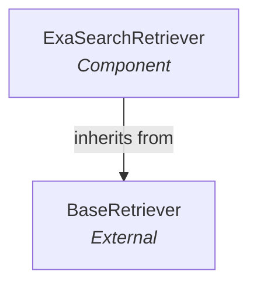

# exa_retrievers
The `exa_retrievers` module provides the `ExaSearchRetriever`, a specialized retriever for performing searches using the Exa API and integrating results into LangChain applications.

<!-- DIAGRAM_JSON
{
    "nodes": [
        {
            "id": "ExaSearchRetriever",
            "label": "ExaSearchRetriever",
            "type": "component"
        },
        {
            "id": "BaseRetriever",
            "label": "BaseRetriever",
            "type": "external",
            "_repaired": "g2_injected_endpoint"
        }
    ],
    "edges": [
        {
            "source": "ExaSearchRetriever",
            "target": "BaseRetriever",
            "type": "inherits",
            "label": "inherits from"
        }
    ],
    "groups": []
}
-->
