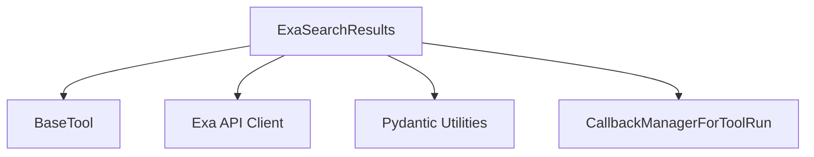

# exa_search_tools Module Documentation

## Introduction

The `exa_search_tools` module provides a specialized tool, `ExaSearchResults`, for performing web searches using the Exa API. This tool is designed to integrate seamlessly into AI agent workflows, allowing agents to retrieve and process search results efficiently. It handles interaction with the Exa API, processes search queries, and formats the results for use within a larger system.

## Architecture and Component Relationships

The `exa_search_tools` module primarily consists of the `ExaSearchResults` class, which extends the `BaseTool` from the `core_tools` module. It leverages the Exa API client for its core search functionality and utilizes Pydantic utilities for configuration and validation. Callback managers from `core_callbacks` are used for managing tool execution.

<!-- DIAGRAM_JSON
{
    "direction": "TD",
    "nodes": [
        {"id": "exa_search_results", "label": "ExaSearchResults", "type": "component", "link": null},
        {"id": "base_tool", "label": "BaseTool", "type": "external", "link": "core_tools.md"},
        {"id": "exa_client", "label": "Exa API Client", "type": "external", "link": null},
        {"id": "pydantic_utilities", "label": "Pydantic Utilities", "type": "external", "link": "core_utils.pydantic_utilities.md"},
        {"id": "callback_manager", "label": "CallbackManagerForToolRun", "type": "external", "link": "core_callbacks.md"}
    ],
    "edges": [
        {"source": "exa_search_results", "target": "base_tool"},
        {"source": "exa_search_results", "target": "exa_client"},
        {"source": "exa_search_results", "target": "pydantic_utilities"},
        {"source": "exa_search_results", "target": "callback_manager"}
    ],
    "groups": []
}
-->



## Module Components

### `ExaSearchResults`

`ExaSearchResults` is a web search tool that interfaces with the Exa API to perform intelligent searches and retrieve relevant information. It extends the functionality of `BaseTool` to provide a standardized interface for AI agents.

**Purpose:**

- Facilitate web searches using the Exa API.
- Retrieve structured search results including URLs, titles, text content, and summaries.
- Support various search parameters such as number of results, domain filtering, date ranges, and content options (highlights, summaries).
- Integrate with the LangChain callback system for monitoring and management of tool execution.

**Key Features:**

- **Exa API Integration:** Directly interacts with the Exa web search API.
- **Configurable Search:** Allows customization of search queries with parameters like `num_results`, `include_domains`, `exclude_domains`, `start_crawl_date`, `end_crawl_date`, `summary`, and more.
- **Pydantic Validation:** Uses Pydantic for robust environment validation and configuration management, ensuring the `EXA_API_KEY` is securely handled.
- **Flexible Output:** Returns search results as a list of dictionaries or a formatted string, depending on the invocation method (direct `invoke` or `ToolCall`).

**Dependencies:**

- `BaseTool` from [core_tools.md](core_tools.md): Provides the fundamental structure and interface for AI tools.
- Exa API Client (external library `langchain-exa`): The core library for interacting with the Exa search service.
- Pydantic utilities from [core_utils.pydantic_utilities.md](core_utils.pydantic_utilities.md): Used for model validation, secret handling (`SecretStr`), and field definition (`Field`).
- `CallbackManagerForToolRun` from [core_callbacks.md](core_callbacks.md): Enables the tool to report its execution status and results to a callback manager.

**Usage Example (from core component):**

```python
# Instantiation:
from langchain-exa import ExaSearchResults

tool = ExaSearchResults()

# Invocation with args:
tool.invoke({"query": "what is the weather in SF", "num_results": 1})

# Invocation with ToolCall:
tool.invoke(
    {
        "args": {"query": "what is the weather in SF", "num_results": 1},
        "id": "1",
        "name": tool.name,
        "type": "tool_call",
    }
)
```
