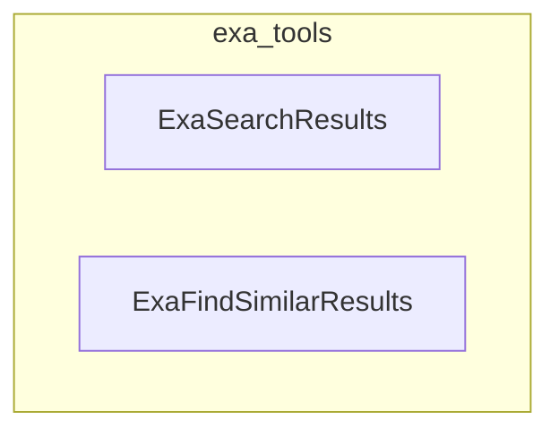

# exa_tools
This module provides `ExaSearchResults` for general web searches and `ExaFindSimilarResults` for discovering pages similar to a given URL, both leveraging the Exa API.

<!-- DIAGRAM_JSON
{
  "nodes": [
    {"id": "ExaSearchResults", "label": "ExaSearchResults", "type": "class"},
    {"id": "ExaFindSimilarResults", "label": "ExaFindSimilarResults", "type": "class"}
  ],
  "edges": [],
  "groups": [
    {"id": "exa_tools", "label": "exa_tools", "nodes": ["ExaSearchResults", "ExaFindSimilarResults"]}
  ]
}
-->
