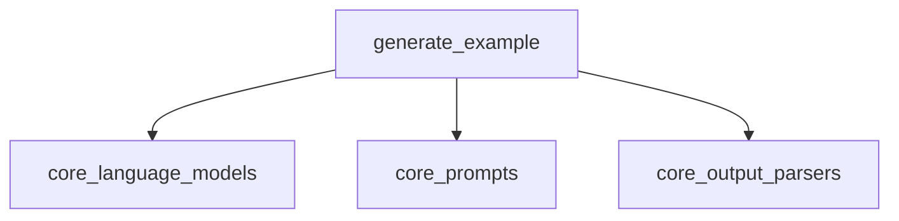

# example_generation Module Documentation

## Introduction

The `example_generation` module, located within the `classic_chains_specialized.data_processing_chains` package, provides a utility for generating new examples based on a set of existing examples and a language model. This is particularly useful in few-shot learning scenarios where additional, synthetically generated examples can enhance model performance or for generating diverse test cases.

## Core Functionality

The primary functionality of this module is encapsulated in the `generate_example` function. This function takes a list of existing examples, a language model (LLM), and a prompt template to construct a `FewShotPromptTemplate`. It then chains this prompt with the provided LLM and a string output parser to produce a new example.

### `generate_example` function

```python
def generate_example(
    examples: list[dict],
    llm: BaseLanguageModel,
    prompt_template: PromptTemplate,
) -> str:
    """Return another example given a list of examples for a prompt."""
    prompt = FewShotPromptTemplate(
        examples=examples,
        suffix=TEST_GEN_TEMPLATE_SUFFIX,
        input_variables=[],
        example_prompt=prompt_template,
    )
    chain = prompt | llm | StrOutputParser()
    return chain.invoke({})
```

**Parameters:**

*   `examples` (`list[dict]`): A list of dictionaries, where each dictionary represents an existing example to be used in the few-shot prompt.
*   `llm` (`BaseLanguageModel`): An instance of a language model to be used for generating the new example. See [core_language_models.md](core_language_models.md) for more information on `BaseLanguageModel`.
*   `prompt_template` (`PromptTemplate`): A prompt template used to format individual examples within the `FewShotPromptTemplate`. See [core_prompts.md](core_prompts.md) for more information on `PromptTemplate`.

**Returns:**

*   `str`: A newly generated example as a string.

**Process Flow:**

1.  A `FewShotPromptTemplate` is constructed using the provided `examples`, a predefined suffix (`TEST_GEN_TEMPLATE_SUFFIX`), and the `prompt_template`.
2.  A runnable chain is created by piping the `FewShotPromptTemplate` with the `llm` and then with a `StrOutputParser` (refer to [core_output_parsers.md](core_output_parsers.md)).
3.  The chain is invoked, and the generated example (as a string) is returned.

## Architecture and Component Relationships

<!-- DIAGRAM_JSON
{
    "direction": "TD",
    "nodes": [
        {"id": "generate_example_func", "label": "generate_example", "type": "component", "link": null},
        {"id": "core_language_models", "label": "core_language_models", "type": "external", "link": "core_language_models.md"},
        {"id": "core_prompts", "label": "core_prompts", "type": "external", "link": "core_prompts.md"},
        {"id": "core_output_parsers", "label": "core_output_parsers", "type": "external", "link": "core_output_parsers.md"}
    ],
    "edges": [
        {"source": "generate_example_func", "target": "core_language_models"},
        {"source": "generate_example_func", "target": "core_prompts"},
        {"source": "generate_example_func", "target": "core_output_parsers"}
    ],
    "groups": []
}
-->



## System Integration

The `example_generation` module is a specialized component within the `classic_chains_specialized.data_processing_chains`. It plays a crucial role in applications requiring dynamic example creation for language models. Its integration allows other chains or higher-level modules to leverage few-shot prompting techniques to generate new, contextually relevant examples without manual intervention. This contributes to the overall adaptability and efficiency of systems dealing with various data processing and generation tasks within the classic LangChain framework.