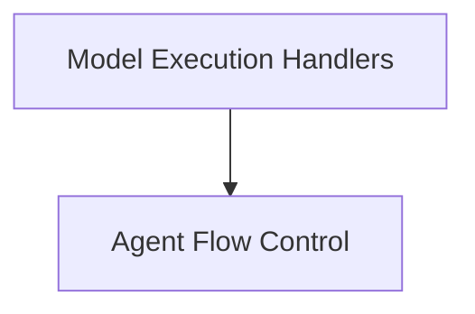

# Execution Handlers Module

The `execution_handlers` module is a core component within the `langchain_v1.langchain.agents.factory` package, responsible for orchestrating the execution flow of agents, particularly in how they interact with language models and tools. It manages the synchronous and asynchronous processing of model requests and determines the subsequent actions an agent should take based on the model's output and the agent's current state.

## Architecture Overview

The module's architecture is centered around two main areas: handling model execution and controlling the agent's flow based on model responses.

<!-- DIAGRAM_JSON
{
    "direction": "TD",
    "nodes": [
        {"id": "model_execution_handlers", "label": "Model Execution Handlers", "type": "module", "link": "model_execution_handlers.md"},
        {"id": "agent_flow_control", "label": "Agent Flow Control", "type": "module", "link": "agent_flow_control.md"}
    ],
    "edges": [
        {"source": "model_execution_handlers", "target": "agent_flow_control"}
    ],
    "groups": []
}
-->

## Sub-modules

### [Model Execution Handlers](model_execution_handlers.md)
This sub-module focuses on the direct interaction with language models. It includes components for both synchronous and asynchronous handling of model requests, integrating middleware for request/response processing, and normalizing model outputs.

### [Agent Flow Control](agent_flow_control.md)
This sub-module is responsible for guiding the agent's decision-making process after a model call. It analyzes the model's response, particularly regarding tool calls and structured outputs, to determine whether the agent should invoke tools, call the model again, or conclude its operation.