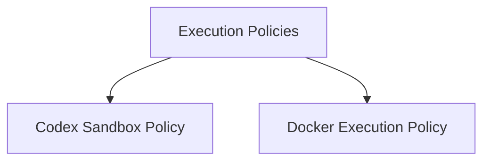

# Execution Policies Module

The `execution_policies` module defines and implements various strategies for executing commands, primarily within a sandbox or isolated environment. These policies are crucial for enhancing security and managing resource allocation when running potentially untrusted code or processes within the agent's ecosystem.

## Architecture Overview

The module comprises different execution policies, each offering distinct levels of isolation and security features. The following diagram illustrates the relationship between the main `execution_policies` module and its core components.

<!-- DIAGRAM_JSON
{
    "direction": "TD",
    "nodes": [
        {"id": "codex_sandbox_policy", "label": "Codex Sandbox Policy", "type": "module", "link": "codex_sandbox_policy.md"},
        {"id": "docker_execution_policy", "label": "Docker Execution Policy", "type": "module", "link": "docker_execution_policy.md"}
    ],
    "edges": [
        {"source": "execution_policies", "target": "codex_sandbox_policy"},
        {"source": "execution_policies", "target": "docker_execution_policy"}
    ],
    "groups": []
}
-->

## Sub-modules

Here's a high-level overview of the sub-modules within `execution_policies`:

*   **[Codex Sandbox Execution Policy](codex_sandbox_policy.md)**: This policy leverages the Codex CLI sandbox to execute commands, providing robust syscall and filesystem restrictions for enhanced security. It's ideal for environments where fine-grained control over execution is required.

*   **[Docker Execution Policy](docker_execution_policy.md)**: This policy isolates command execution within dedicated Docker containers. It's designed for scenarios requiring strong isolation, such as when processing commands from untrusted sources, and offers configurable options for network, memory, and CPU limits.