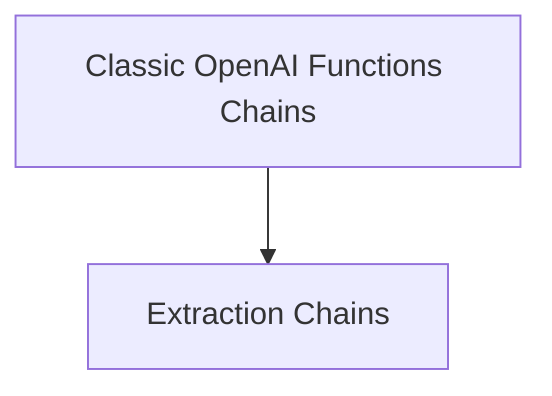

# Extraction Chains Module

The `extraction_chains` module provides tools for extracting structured information from unstructured text using OpenAI's function calling capabilities. It offers flexible methods to define the extraction schema, either through a simple dictionary or a Pydantic model.

## Architecture Overview

The `extraction_chains` module is a sub-module of `classic_chains_openai_functions`, focusing specifically on information extraction. It leverages language models (`LLMChain`) and output parsers to convert unstructured text into structured data based on a predefined schema.

<!-- DIAGRAM_JSON
{
    "direction": "TD",
    "nodes": [
        {"id": "extraction_chains", "label": "Extraction Chains", "type": "module"},
        {"id": "classic_chains_openai_functions", "label": "OpenAI Functions Chains", "type": "module", "link": "classic_chains_openai_functions.md"}
    ],
    "edges": [
        {"source": "classic_chains_openai_functions", "target": "extraction_chains"}
    ],
    "groups": []
}
-->

## Core Functionality

### `create_extraction_chain`

This function creates a chain designed to extract information from a given passage based on a dictionary schema. It constructs an `LLMChain` configured with the provided language model, an extraction prompt, and a `JsonKeyOutputFunctionsParser` to process the model's output into a structured dictionary.

### `create_extraction_chain_pydantic`

This function extends the extraction capabilities by allowing users to define the extraction schema using a Pydantic model. It automatically converts the Pydantic schema into an OpenAI function schema and uses a `PydanticAttrOutputFunctionsParser` to ensure the extracted information conforms to the specified Pydantic model, providing strong typing and validation for the output.
