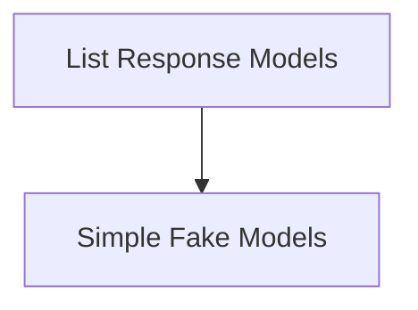

# Fake Chat Models

## Introduction

The `fake_chat_models` module provides a set of dummy chat model implementations primarily used for testing and development purposes. These models mimic the behavior of real chat models without requiring actual API calls or complex logic, allowing for isolated and predictable testing of components that interact with chat models.

## Architecture

The `fake_chat_models` module is composed of several specialized fake chat model implementations, each designed for different testing scenarios. These models inherit from core `langchain_core` classes and provide simplified `_call`, `_stream`, `_agenerate`, or `_generate` methods.

<!-- DIAGRAM_JSON
{
    "direction": "TD",
    "nodes": [
        {"id": "list_response_models", "label": "List Response Models", "type": "module", "link": "list_response_models.md"},
        {"id": "simple_fake_models", "label": "Simple Fake Models", "type": "module", "link": "simple_fake_models.md"}
    ],
    "edges": [
        {"source": "list_response_models", "target": "simple_fake_models"}
    ],
    "groups": []
}
-->

## Sub-modules

### [List Response Models](list_response_models.md)

This sub-module contains fake chat models that simulate responses by cycling through a predefined list of strings or `BaseMessage` objects. They are useful for testing scenarios where specific, ordered responses are required.

### [Simple Fake Models](simple_fake_models.md)

This sub-module includes basic fake chat models that provide either a fixed, generic response or simply echo the last input message. These models are ideal for general integration tests where the exact content of the response is less critical than the interaction itself.
