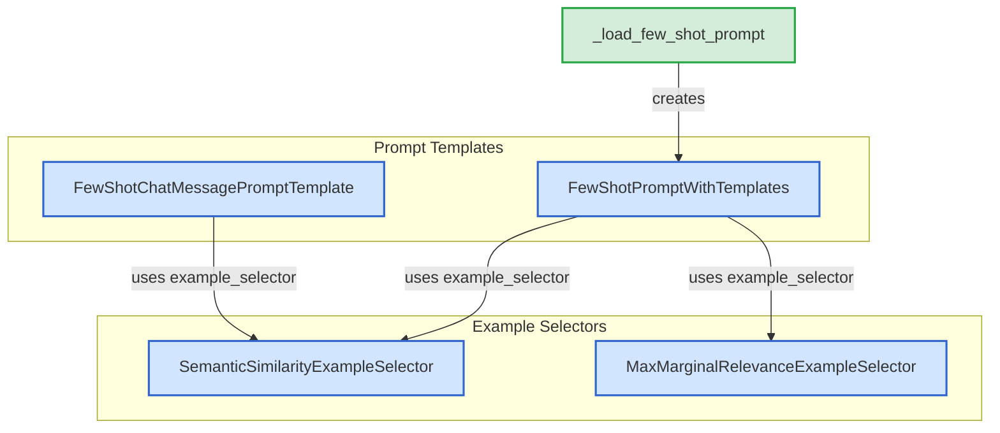

# few_shot_and_examples
This module provides various prompt templates for few-shot learning and example selectors to dynamically choose relevant examples based on semantic similarity or maximal marginal relevance.

<!-- DIAGRAM_JSON
{
  "nodes": [
    {
      "id": "FSCMPT",
      "label": "FewShotChatMessagePromptTemplate",
      "type": "class"
    },
    {
      "id": "FSPWT",
      "label": "FewShotPromptWithTemplates",
      "type": "class"
    },
    {
      "id": "SSES",
      "label": "SemanticSimilarityExampleSelector",
      "type": "class"
    },
    {
      "id": "MMRES",
      "label": "MaxMarginalRelevanceExampleSelector",
      "type": "class"
    },
    {
      "id": "LFSP",
      "label": "_load_few_shot_prompt",
      "type": "function"
    }
  ],
  "edges": [
    {
      "source": "FSCMPT",
      "target": "SSES",
      "label": "uses example_selector"
    },
    {
      "source": "FSPWT",
      "target": "SSES",
      "label": "uses example_selector"
    },
    {
      "source": "FSPWT",
      "target": "MMRES",
      "label": "uses example_selector"
    },
    {
      "source": "LFSP",
      "target": "FSPWT",
      "label": "creates"
    }
  ],
  "groups": [
    {
      "id": "prompt_templates",
      "label": "Prompt Templates",
      "nodes": ["FSCMPT", "FSPWT"]
    },
    {
      "id": "example_selectors",
      "label": "Example Selectors",
      "nodes": ["SSES", "MMRES"]
    }
  ]
}
-->
