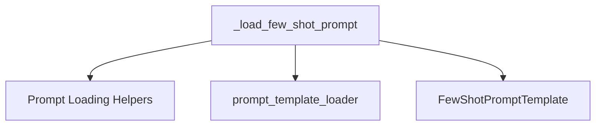

# few_shot_prompt_loader

The `few_shot_prompt_loader` module is a crucial component within the `core_prompts` system, specifically designed for loading and configuring few-shot prompt templates. Its primary function is to interpret a given configuration dictionary and construct a `FewShotPromptTemplate` object, enabling dynamic and flexible prompt creation based on examples.

## Purpose and Core Functionality

The core functionality of this module is encapsulated within the `_load_few_shot_prompt` function. This function takes a configuration dictionary and an `allow_dangerous_paths` flag to securely load a few-shot prompt.

The `_load_few_shot_prompt` function performs the following key operations:
1.  **Loads Suffix and Prefix Templates**: It first processes the "suffix" and "prefix" templates from the configuration, likely utilizing internal helper functions within the `prompt_loading` context.
2.  **Loads Example Prompt**: It intelligently loads the `example_prompt`. This can be done either directly from a nested configuration or by loading a prompt definition from a specified file path (`example_prompt_path`). It includes validation to ensure that only one method for specifying the example prompt is used.
3.  **Loads Examples**: After handling the individual example prompt, it proceeds to load the actual "examples" which are crucial for few-shot prompting.
4.  **Loads Output Parser**: Finally, it loads any associated output parser configuration.
5.  **Constructs FewShotPromptTemplate**: All parsed components are then used to instantiate and return a `FewShotPromptTemplate` object.

This module ensures that few-shot prompts, including their structure, examples, and associated elements, can be loaded efficiently and safely from various configuration sources.

## Architecture and Component Relationships

The `few_shot_prompt_loader` module primarily interacts with other components within the `core_prompts` and `prompt_loading` ecosystem.

<!-- DIAGRAM_JSON
{
    "direction": "TD",
    "nodes": [
        {"id": "_load_few_shot_prompt", "label": "_load_few_shot_prompt", "type": "component", "link": null},
        {"id": "few_shot_prompt_template", "label": "FewShotPromptTemplate", "type": "external", "link": "few_shot_prompts.md"},
        {"id": "prompt_loading_helpers", "label": "Prompt Loading Helpers", "type": "component", "link": null},
        {"id": "prompt_template_loader", "label": "prompt_template_loader", "type": "external", "link": "prompt_template_loader.md"}
    ],
    "edges": [
        {"source": "_load_few_shot_prompt", "target": "prompt_loading_helpers"},
        {"source": "_load_few_shot_prompt", "target": "prompt_template_loader"},
        {"source": "_load_few_shot_prompt", "target": "few_shot_prompt_template"}
    ],
    "groups": []
}
-->

### Component Breakdown:

*   **`_load_few_shot_prompt`**: The central function of this module, orchestrating the loading process of a few-shot prompt from a configuration.
*   **Prompt Loading Helpers**: This conceptual component represents internal utility functions like `_load_template`, `_validate_path`, `_load_examples`, and `_load_output_parser` that assist `_load_few_shot_prompt` in its operations. These functions are typically co-located within the `prompt_loading` module or its immediate scope.
*   **`few_shot_prompt_template`**: This external dependency refers to the `FewShotPromptTemplate` class, which is the ultimate output of this module's loading process. It is defined in the [few_shot_prompts](few_shot_prompts.md) module.
*   **`prompt_template_loader`**: This module acts as an external dependency, providing core functionalities such as `load_prompt` and `load_prompt_from_config`, which are essential for loading individual prompt components, especially the example prompt, from various sources. Refer to the [prompt_template_loader](prompt_template_loader.md) documentation for more details.

## How the Module Fits into the Overall System

The `few_shot_prompt_loader` module is an integral part of the `core_prompts.prompt_loading` sub-package. It specializes in handling the specific complexities of few-shot prompts, complementing the more general prompt loading mechanisms available. By centralizing the logic for loading few-shot prompts, it ensures consistency, reusability, and maintainability across the system when applications require prompts that learn from examples. It relies on the fundamental prompt structures defined in `few_shot_prompts` and leverages the broader loading capabilities provided by the `prompt_loading` parent module and its siblings like `prompt_template_loader`. This modular design allows for clear separation of concerns, making the prompt engineering workflow robust and scalable.