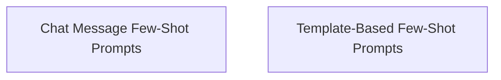

# Few-Shot Prompts Module

## Introduction and Purpose

The `few_shot_prompts` module provides robust mechanisms for incorporating few-shot examples into prompt engineering, enhancing the ability of language models to perform specific tasks by showing them examples. It offers distinct approaches for chat-based interactions and traditional string-based prompt templates, allowing developers to craft highly effective and contextually rich prompts.

## Architecture Overview

The module is structured into two primary sub-modules, each addressing a different paradigm of few-shot prompting:

<!-- DIAGRAM_JSON
{
    "direction": "TD",
    "nodes": [
        {"id": "chat_message_few_shot_prompts", "label": "Chat Message Few-Shot Prompts", "type": "module", "link": "chat_message_few_shot_prompts.md"},
        {"id": "template_based_few_shot_prompts", "label": "Template-Based Few-Shot Prompts", "type": "module", "link": "template_based_few_shot_prompts.md"}
    ],
    "edges": [
        
    ],
    "groups": []
}
-->

## Sub-modules

### [Chat Message Few-Shot Prompts](chat_message_few_shot_prompts.md)
This sub-module focuses on creating few-shot prompts specifically designed for chat models. It allows for the integration of example messages to guide the model's conversational responses, supporting both fixed example sets and dynamic selection based on input.

### [Template-Based Few-Shot Prompts](template_based_few_shot_prompts.md)
This sub-module provides a flexible way to construct few-shot prompts using string-based templates. It enables the inclusion of examples, along with customizable prefixes and suffixes, to create structured prompts for various language model tasks.

## How the Module Fits into the Overall System

The `few_shot_prompts` module is a core component within the larger `core_prompts` system, which is responsible for prompt construction and management. It leverages other `core_prompts` functionalities for template handling and integrates with `core_example_selectors` for dynamic example retrieval. Its outputs are typically consumed by language models from modules like `core_language_models` or `core_chat_history` for execution, forming a crucial part of how applications interact with and guide large language models.