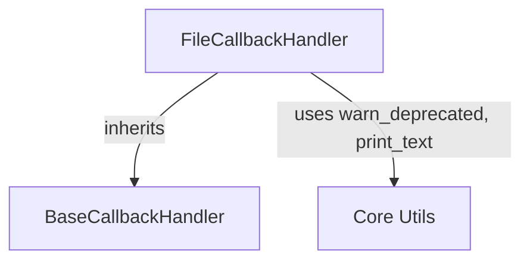

# file_handlers Module Documentation

The `file_handlers` module provides a callback handler specifically designed for writing the events of a LangChain run to a file. This module is a crucial part of the `core_callbacks` system, enabling persistent logging and detailed introspection of agent and chain executions.

<!-- DIAGRAM_JSON
{
    "direction": "TD",
    "nodes": [
        {"id": "file_callback_handler", "label": "FileCallbackHandler", "type": "component", "link": null},
        {"id": "base_callback_handler", "label": "BaseCallbackHandler", "type": "external", "link": "base_handlers.md"},
        {"id": "core_utils", "label": "Core Utils", "type": "external", "link": "core_utils.md"}
    ],
    "edges": [
        {"source": "file_callback_handler", "target": "base_callback_handler", "label": "inherits"},
        {"source": "file_callback_handler", "target": "core_utils", "label": "uses warn_deprecated, print_text"}
    ],
    "groups": []
}
-->


## Architecture and Component Relationships

The `file_handlers` module centers around the `FileCallbackHandler` class, which extends the `BaseCallbackHandler` from the [base_handlers module](base_handlers.md). This inheritance provides a standardized interface for handling various events during a LangChain execution, such as chain starts/ends, agent actions, tool outputs, and general text outputs.

The `FileCallbackHandler` interacts with core utility functions (assumed to be from the [core_utils module](core_utils.md)) for handling deprecation warnings (`warn_deprecated`) and for writing formatted text to the file (`print_text`).

## Core Components

### FileCallbackHandler

`FileCallbackHandler` is a callback handler that logs LangChain events to a specified file. It supports both a recommended context manager usage pattern for automatic file handling and a direct instantiation method for backward compatibility, although the latter is deprecated.

**Purpose:**
To provide a simple, file-based logging mechanism for LangChain execution events, facilitating debugging, auditing, and detailed run analysis.

**Key Features:**

*   **File-based Logging:** Writes all captured events to a text file.
*   **Context Manager Support:** Recommended usage for automatic file opening and closing, ensuring resources are properly managed.
*   **Customizable Output:** Allows specifying the filename, file mode (append, write, etc.), and default text color for the output.
*   **Event Handling:** Overrides methods from `BaseCallbackHandler` to capture and log events such as:
    *   `on_chain_start`: Logs the start of a chain.
    *   `on_chain_end`: Logs the end of a chain.
    *   `on_agent_action`: Logs actions taken by an agent.
    *   `on_tool_end`: Logs the output of a tool execution.
    *   `on_text`: Logs general text output.
    *   `on_agent_finish`: Logs the final output of an agent.

**Constructor (`__init__`)**:
Initializes the handler with a filename, file mode, and an optional default color. It immediately opens the file.

**Context Management (`__enter__`, `__exit__`)**:
`__enter__` marks the handler's usage within a `with` statement. `__exit__` ensures the file is properly closed when exiting the context.

**Lifecycle (`__del__`, `close`)**:
`__del__` acts as a destructor to close the file if it's still open when the object is garbage collected. The `close()` method provides an explicit way to close the file, which is recommended when not using the context manager.

**Internal Write Method (`_write`)**:
A private helper method responsible for writing text to the file, handling deprecation warnings for non-context manager usage, and ensuring the file is open before writing.

## How the Module Fits into the Overall System

The `file_handlers` module is a specific implementation within the `core_callbacks` system. It provides a concrete way for developers to persist the execution logs of their LangChain applications. By adhering to the `BaseCallbackHandler` interface, `FileCallbackHandler` can be easily integrated into any LangChain runnable, chain, or agent, allowing for flexible monitoring and debugging without altering the core logic of the application.

It depends on `base_handlers` for its base class and `core_utils` for utility functions like `warn_deprecated` and `print_text`. This modular design allows for independent development and testing of callback functionalities, while ensuring consistency through the shared `BaseCallbackHandler` interface.

## Usage Examples

### Recommended Usage (Context Manager)

```python
from libs.core.langchain_core.callbacks.file import FileCallbackHandler
# Assuming 'chain' is a LangChain chain or agent
# from langchain.chains import LLMChain
# from langchain.llms import OpenAI

# llm = OpenAI()
# chain = LLMChain(llm=llm, prompt="Hello {name}!")

with FileCallbackHandler("output.txt", mode="w") as handler:
    # Use handler with your chain/agent
    # For example:
    # chain.invoke({"name": "World"}, config={"callbacks": [handler]})
    print("Events will be written to output.txt") # Placeholder for actual chain invocation
```

### Deprecated Usage (Direct Instantiation)

```python
from libs.core.langchain_core.callbacks.file import FileCallbackHandler
# Assuming 'chain' is a LangChain chain or agent

handler = FileCallbackHandler("output.txt", mode="a", color="green")
try:
    # For example:
    # chain.invoke({"name": "LangChain"}, config={"callbacks": [handler]})
    print("Events will be appended to output.txt (deprecated usage)") # Placeholder
finally:
    handler.close()  # Explicit cleanup recommended
```
