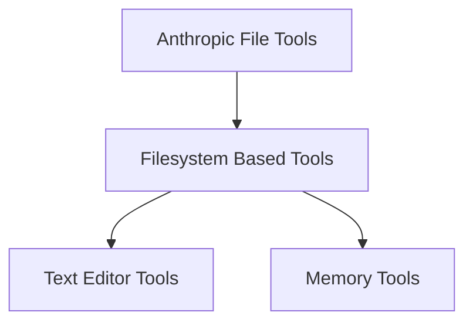

# Filesystem-Based Tools Module

## Introduction

The `filesystem_based_tools` module provides middleware for Anthropic Claude agents, enabling them to interact with the local filesystem for text editing and memory management. This module allows agents to persist information and modify files, with user control over storage mechanisms like volumes or Git.

## Architecture

This module integrates into the overall system as a component of `anthropic_file_tools`, offering specific filesystem interaction capabilities. It is composed of two primary sub-modules:

<!-- DIAGRAM_JSON
{
    "direction": "TD",
    "nodes": [
        {"id": "anthropic_file_tools", "label": "Anthropic File Tools", "type": "external", "link": "anthropic_file_tools.md"},
        {"id": "filesystem_based_tools", "label": "Filesystem Based Tools", "type": "module", "link": "filesystem_based_tools.md"},
        {"id": "text_editor_tools", "label": "Text Editor Tools", "type": "module", "link": "text_editor_tools.md"},
        {"id": "memory_tools", "label": "Memory Tools", "type": "module", "link": "memory_tools.md"}
    ],
    "edges": [
        {"source": "anthropic_file_tools", "target": "filesystem_based_tools"},
        {"source": "filesystem_based_tools", "target": "text_editor_tools"},
        {"source": "filesystem_based_tools", "target": "memory_tools"}
    ],
    "groups": []
}
-->

## Sub-modules

### [Text Editor Tools](text_editor_tools.md)

This sub-module provides functionality for agents to perform text editing operations directly on the filesystem. It enables agents to read, write, and modify text files within a specified root path.

### [Memory Tools](memory_tools.md)

The memory tools sub-module offers agents the ability to store and retrieve information as "memories" on the filesystem. It enforces a `/memories` prefix for all operations and injects Anthropic's recommended system prompt for memory interaction.