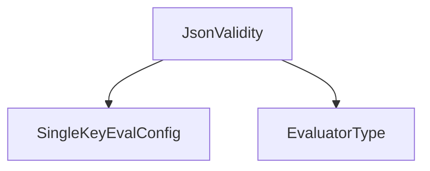

# `format_evaluators` Module Documentation

## Introduction

The `format_evaluators` module, located within `classic_smith_evaluation.evaluation_configurations`, is responsible for defining configuration classes for various format-specific evaluators. Its primary role is to provide structured configurations for evaluating the adherence of model outputs to specific data formats, such as JSON validity.

## Module Purpose and Core Functionality

This module specializes in housing configuration objects that guide the behavior of format-checking evaluators in the LangChain `classic` evaluation system. The main functionality revolves around defining concrete configuration classes that inherit from more general evaluation configuration types and specify the `EvaluatorType` for format validation tasks.

### Core Components

*   **`JsonValidity`**: This class provides the configuration for an evaluator that checks whether a given output is a syntactically valid JSON string. It inherits from `SingleKeyEvalConfig` and sets its `evaluator_type` to `EvaluatorType.JSON_VALIDITY`.

## Architecture and Component Relationships

The `format_evaluators` module is a leaf module within the `classic_smith_evaluation.evaluation_configurations` hierarchy. It depends on base configuration classes and enumerations defined in its parent `evaluation_configurations` module or a more general `config` module.

<!-- DIAGRAM_JSON
{
    "direction": "TD",
    "nodes": [
        {"id": "json_validity", "label": "JsonValidity", "type": "component", "link": null},
        {"id": "single_key_eval_config", "label": "SingleKeyEvalConfig", "type": "external", "link": "evaluation_configurations.md"},
        {"id": "evaluator_type", "label": "EvaluatorType", "type": "external", "link": "evaluation_configurations.md"}
    ],
    "edges": [
        {"source": "json_validity", "target": "single_key_eval_config"},
        {"source": "json_validity", "target": "evaluator_type"}
    ],
    "groups": []
}
-->

## How it Fits into the Overall System

The `format_evaluators` module is a crucial part of the `classic_smith_evaluation` system, specifically within the `evaluation_configurations` sub-system. It provides the necessary configuration blueprints for evaluators that assess the structural correctness of model outputs. By defining format-specific evaluation configurations like `JsonValidity`, it enables the broader evaluation framework to perform automated checks on the syntax and structure of generated content, ensuring outputs adhere to expected formats. This is vital for tasks requiring structured data outputs from language models.

This module integrates with other parts of the evaluation system:

*   **`evaluation_configurations`**: It extends and utilizes base classes and enums from the parent module to build specific format evaluation configurations.
*   **`evaluation_runner`**: Configurations defined here are consumed by the `evaluation_runner` to set up and execute format-based evaluations against model predictions. Refer to [evaluation_runner.md](evaluation_runner.md) for more details.
*   **Other Evaluator Modules**: While this module focuses on format *configurations*, the actual logic for *performing* the format evaluation would reside in a corresponding evaluator implementation module, which would use these configurations. Such modules are typically found alongside `format_evaluators` within `classic_smith_evaluation`.