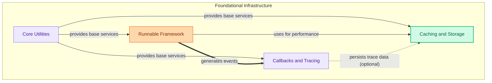

The `foundational_components` module serves as the bedrock for building robust and observable AI applications. It provides essential utilities for API lifecycle management and security, a flexible framework for composing executable units (Runnables), comprehensive mechanisms for tracing and event handling, and efficient caching and storage solutions. These components work in concert to enable developers to create modular, performant, and maintainable AI systems.

### Core Components Documentation

*   [Core Utilities](core_utilities.md)
*   [Runnable Framework](runnable_framework.md)
*   [Callbacks and Tracing](callbacks_and_tracing.md)
*   [Caching and Storage](caching_and_storage.md)