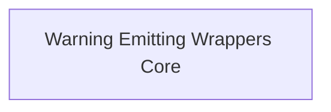

# function_warning_wrappers

This module provides core functionality for wrapping functions to emit beta warnings. It includes both synchronous and asynchronous wrappers that ensure a warning is emitted only once per function call when the function is invoked by an external caller. This mechanism helps in notifying users about the beta status of certain features or APIs.

## Architecture Overview

The `function_warning_wrappers` module primarily consists of wrappers designed to intercept function calls and conditionally emit warnings. It integrates with internal checks to prevent warnings for internal usage, ensuring a clean developer experience while still informing external consumers about beta features.

<!-- DIAGRAM_JSON
{
    "direction": "TD",
    "nodes": [
        {"id": "warning_emitting_wrappers_core", "label": "Warning Emitting Wrappers Core", "type": "module", "link": "warning_emitting_wrappers_core.md"}
    ],
    "edges": [],
    "groups": []
}
-->

## Module Functionality

### Warning Emitting Wrappers Core

This sub-module contains the fundamental synchronous and asynchronous function wrappers responsible for emitting beta warnings. It intelligently tracks whether a warning has already been issued for a given function and checks the caller's origin to avoid redundant or internal warnings.

For more details, refer to the [Warning Emitting Wrappers Core documentation](warning_emitting_wrappers_core.md).