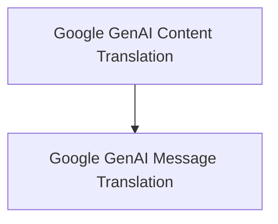

# genai_content_translation Module Documentation

## Introduction

The `genai_content_translation` module is a specialized component within the larger `langchain_core.messages.block_translators.google_genai` system. Its primary purpose is to facilitate the translation of Google GenAI-specific message formats (`AIMessage` and `AIMessageChunk`) into a standardized list of content blocks. This ensures interoperability and consistent handling of message content across different parts of the LangChain framework.

## Architecture Overview

The `genai_content_translation` module is a sub-module of `google_genai_translators`, which is responsible for handling various translation functionalities related to Google GenAI. It directly leverages the `genai_message_translation` sub-module to perform the actual content translation.

<!-- DIAGRAM_JSON
{
    "direction": "TD",
    "nodes": [
        {"id": "genai_content_translation", "label": "Google GenAI Content Translation", "type": "module", "link": "genai_content_translation.md"},
        {"id": "genai_message_translation", "label": "Google GenAI Message Translation", "type": "module", "link": "genai_message_translation.md"}
    ],
    "edges": [
        {"source": "genai_content_translation", "target": "genai_message_translation"}
    ],
    "groups": []
}
-->

## Sub-modules

### [Google GenAI Message Translation](genai_message_translation.md)

This sub-module contains the core logic for translating Google GenAI AIMessage and AIMessageChunk objects into standard content blocks. It provides the `translate_content` and `translate_content_chunk` functions, which are essential for standardizing message content within the LangChain ecosystem. More details can be found in its dedicated documentation file. 
