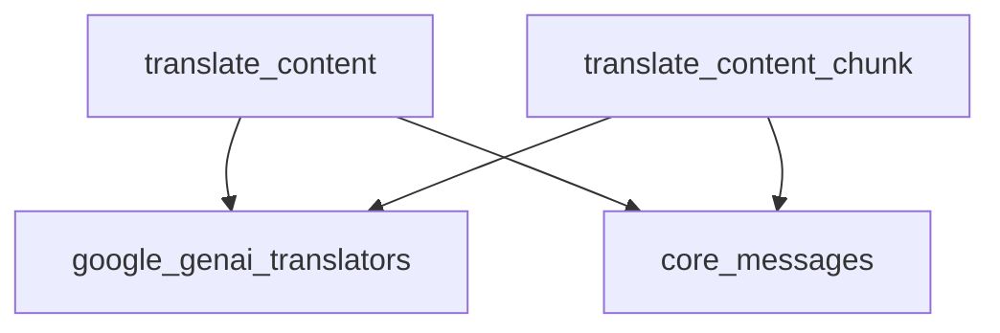

# genai_message_translation

## Introduction

The `genai_message_translation` module is a specialized component within the larger message translation system, specifically designed to handle messages originating from Google's Generative AI (GenAI) platform. Its primary function is to convert GenAI-specific message formats, `AIMessage` and `AIMessageChunk`, into a standardized `ContentBlock` representation used throughout the system. This standardization is crucial for ensuring interoperability and consistent processing of messages from various AI providers.

## Architecture and Component Relationships

This module provides two core functions responsible for the translation process. These functions interact with the broader `google_genai_translators` module, which likely houses the underlying conversion logic, and rely on types defined in the `core_messages` module.

<!-- DIAGRAM_JSON
{
    "direction": "TD",
    "nodes": [
        {"id": "translate_content", "label": "translate_content", "type": "component", "link": null},
        {"id": "translate_content_chunk", "label": "translate_content_chunk", "type": "component", "link": null},
        {"id": "google_genai_translators", "label": "google_genai_translators", "type": "external", "link": "google_genai_translators.md"},
        {"id": "core_messages", "label": "core_messages", "type": "external", "link": "core_messages.md"}
    ],
    "edges": [
        {"source": "translate_content", "target": "google_genai_translators"},
        {"source": "translate_content_chunk", "target": "google_genai_translators"},
        {"source": "translate_content", "target": "core_messages"},
        {"source": "translate_content_chunk", "target": "core_messages"}
    ],
    "groups": []
}
-->

### Core Components

- **`translate_content(message: AIMessage) -> list[types.ContentBlock]`**:
    This function takes an `AIMessage` object, which is a message format specific to Google GenAI, and translates it into a list of `ContentBlock` objects. `ContentBlock` represents a standardized way of structuring content within the system. This function is typically used for translating complete messages.

- **`translate_content_chunk(message: AIMessageChunk) -> list[types.ContentBlock]`**:
    Similar to `translate_content`, this function handles `AIMessageChunk` objects, which represent partial or streamed messages from Google GenAI. It also translates these chunks into a list of `ContentBlock` objects, enabling incremental processing of GenAI responses.

## System Integration

The `genai_message_translation` module plays a vital role in integrating Google GenAI with the rest of the system. By providing a consistent translation layer, it allows other modules to process GenAI output without needing to understand the intricacies of Google's specific message formats. This module is a leaf component within the [google_genai_translators](google_genai_translators.md) module, which is part of the broader [core_messages](core_messages.md) module responsible for handling all message-related operations. Its existence ensures that messages from Google GenAI are seamlessly converted into a common format, facilitating further processing, analysis, and display within the application.