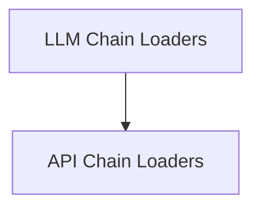

# general_purpose_chains_loading Module Documentation

## Introduction

The `general_purpose_chains_loading` module is a crucial component within the `classic_chains_loading` system, responsible for dynamically loading various general-purpose chains based on their configurations. This module abstracts the complexity of instantiating different types of chains, allowing for flexible and extensible chain management within the LangChain framework.

## Architecture

The `general_purpose_chains_loading` module is organized into sub-modules, each handling the loading of specific categories of chains. The following diagram illustrates the architecture and relationships between these sub-modules:

<!-- DIAGRAM_JSON
{
    "direction": "TD",
    "nodes": [
        {"id": "llm_chain_loaders", "label": "LLM Chain Loaders", "type": "module", "link": "llm_chain_loaders.md"},
        {"id": "api_chain_loaders", "label": "API Chain Loaders", "type": "module", "link": "api_chain_loaders.md"}
    ],
    "edges": [
        {"source": "llm_chain_loaders", "target": "api_chain_loaders"}
    ],
    "groups": []
}
-->

## Sub-modules

This module contains the following sub-modules:

*   ### [LLM Chain Loaders](llm_chain_loaders.md)

    The `llm_chain_loaders` sub-module provides functionality for loading various types of chains that are built around Large Language Models (LLMs). This includes general-purpose LLM chains, chains for mathematical operations, and chains designed for checking assertions and refining answers.

*   ### [API Chain Loaders](api_chain_loaders.md)

    The `api_chain_loaders` sub-module is responsible for loading chains that interact with external APIs or perform HTTP requests. It handles the instantiation of API-specific chains, ensuring proper configuration for making and responding to API calls.
