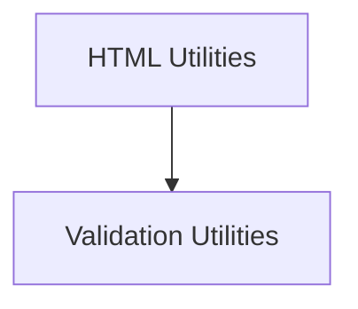

# General Utilities Module

The `general_utilities` module provides a collection of essential utility functions designed to support various operations across the system. These utilities range from HTML parsing and link extraction to robust argument validation, ensuring consistency and reliability in data processing and function calls.

## Architecture Overview

The `general_utilities` module is structured into several sub-modules, each focusing on a specific area of utility. The current architecture includes `html_utilities` for web content processing and `validation_utilities` for input validation. These sub-modules are designed to be loosely coupled, allowing for independent development and easy integration into different parts of the system.

<!-- DIAGRAM_JSON
{
    "direction": "TD",
    "nodes": [
        {"id": "html_utilities", "label": "HTML Utilities", "type": "module", "link": "html_utilities.md"},
        {"id": "validation_utilities", "label": "Validation Utilities", "type": "module", "link": "validation_utilities.md"}
    ],
    "edges": [
        {"source": "html_utilities", "target": "validation_utilities"}
    ],
    "groups": []
}
-->

## Sub-modules

### [HTML Utilities](html_utilities.md)
This sub-module focuses on functionalities related to processing HTML content, primarily for extracting and normalizing links.

### [Validation Utilities](validation_utilities.md)
This sub-module contains utility functions for validating arguments and ensuring that function calls receive the correct and expected input parameters.