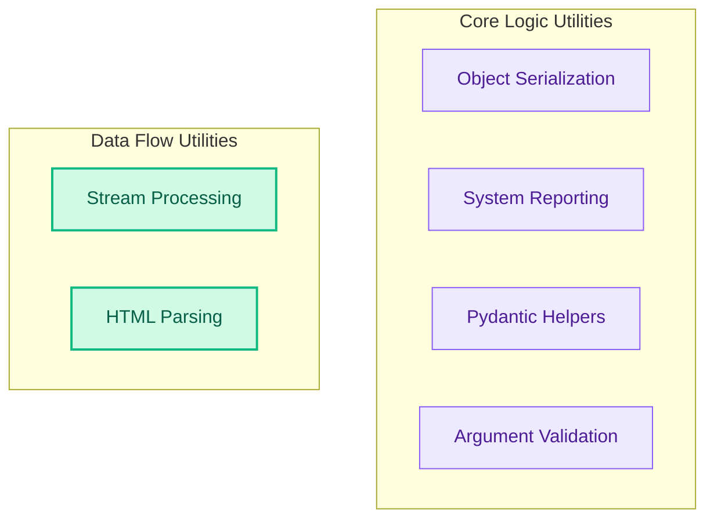

# General Utilities
This module provides a collection of fundamental utilities, including object serialization, system information reporting, stream processing, HTML link extraction, Pydantic model helpers, and function argument validation.

<!-- DIAGRAM_JSON
{
    "direction": "TD",
    "nodes": [
        {"id": "serialization_module", "label": "Object Serialization", "type": "module", "link": "serialization_module.md"},
        {"id": "system_reporting", "label": "System Reporting", "type": "module", "link": "system_reporting.md"},
        {"id": "stream_processing", "label": "Stream Processing", "type": "module", "link": "stream_processing.md"},
        {"id": "html_parsing", "label": "HTML Parsing", "type": "module", "link": "html_parsing.md"},
        {"id": "pydantic_helpers", "label": "Pydantic Helpers", "type": "module", "link": "pydantic_helpers.md"},
        {"id": "argument_validation", "label": "Argument Validation", "type": "module", "link": "argument_validation.md"}
    ],
    "edges": [],
    "groups": [
        {"id": "core_logic_utils", "label": "Core Logic Utilities", "role": "analytical", "nodes": ["serialization_module", "system_reporting", "pydantic_helpers", "argument_validation"]},
        {"id": "data_flow_utils", "label": "Data Flow Utilities", "role": "data", "nodes": ["stream_processing", "html_parsing"]}
    ]
}
-->
