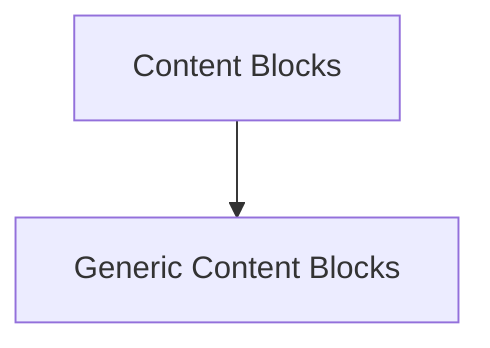

# Generic Content Blocks

## Introduction and Purpose

The `generic_content_blocks` module is a crucial part of the messaging system within LangChain Core, specifically designed for handling flexible and extensible content types within chat messages. It provides functionalities to create file-based content and generic, non-standard content blocks, allowing for broad compatibility and custom data integration.

This module is a sub-module of the [content_blocks](content_blocks.md) module, which focuses on various content types used in messages.

## Architecture Overview

The `generic_content_blocks` module provides direct utilities for creating specialized content blocks. It directly serves the needs of the `content_blocks` module by offering specific content creation functions.

<!-- DIAGRAM_JSON
{
    "direction": "TD",
    "nodes": [
        {"id": "content_blocks", "label": "Content Blocks", "type": "module", "link": "content_blocks.md"},
        {"id": "generic_content_blocks", "label": "Generic Content Blocks", "type": "module", "link": "generic_content_blocks.md"}
    ],
    "edges": [
        {"source": "content_blocks", "target": "generic_content_blocks"}
    ],
    "groups": []
}
-->

## Core Functionality

This module offers functions for creating two distinct types of content blocks:

### `create_file_block`

This function allows for the creation of content blocks that represent files. It supports specifying files via URL, base64 encoding, or a file ID from a storage system, along with its MIME type. This is essential for rich messaging applications that need to include documents, images, or other media directly within conversations.

**Components:**
*   `libs.core.langchain_core.messages.content.create_file_block`

### `create_non_standard_block`

The `create_non_standard_block` function provides a flexible way to embed provider-specific or custom content data within a message. This is particularly useful when integrating with external services that have unique data formats not covered by standard content block types, ensuring extensibility and adaptability of the messaging system.

**Components:**
*   `libs.core.langchain_core.messages.content.create_non_standard_block`
