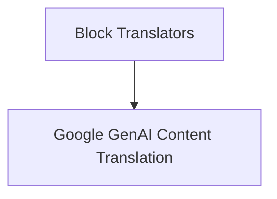

# Google GenAI Translators Module

This module provides functionality for translating Google GenAI specific message formats into a standardized set of content blocks. It ensures interoperability between Google GenAI's message structures and the core messaging system.

## Architecture

The `google_genai_translators` module primarily consists of functions designed to convert different types of Google GenAI messages (full messages and message chunks) into a common content block representation. This module is a child of the `block_translators` module, indicating its role in a broader message translation system.

<!-- DIAGRAM_JSON
{
    "direction": "TD",
    "nodes": [
        {"id": "genai_content_translation", "label": "Google GenAI Content Translation", "type": "module", "link": "genai_content_translation.md"},
        {"id": "block_translators", "label": "Block Translators", "type": "module", "link": "block_translators.md"}
    ],
    "edges": [
        {"source": "block_translators", "target": "genai_content_translation"}
    ],
    "groups": []
}
-->

## Sub-modules

### [Google GenAI Content Translation](genai_content_translation.md)
This sub-module focuses on the core translation logic for Google GenAI messages, providing functions to convert both complete messages and message chunks into a consistent content block format.