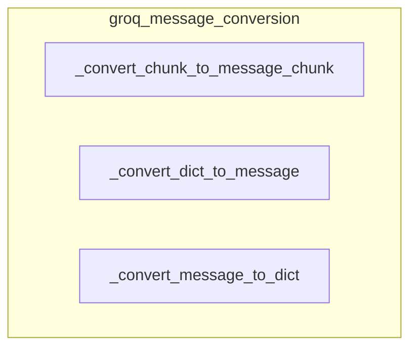

# groq_message_conversion
This module provides utility functions for converting message formats between Groq's API and LangChain's `BaseMessage` and `BaseMessageChunk` types, enabling seamless data exchange.

<!-- DIAGRAM_JSON
{
  "nodes": [
    {
      "id": "_convert_chunk_to_message_chunk",
      "label": "_convert_chunk_to_message_chunk"
    },
    {
      "id": "_convert_dict_to_message",
      "label": "_convert_dict_to_message"
    },
    {
      "id": "_convert_message_to_dict",
      "label": "_convert_message_to_dict"
    }
  ],
  "edges": [],
  "groups": [
    {
      "id": "groq_message_conversion",
      "label": "groq_message_conversion",
      "nodes": [
        "_convert_chunk_to_message_chunk",
        "_convert_dict_to_message",
        "_convert_message_to_dict"
      ]
    }
  ]
}
-->
