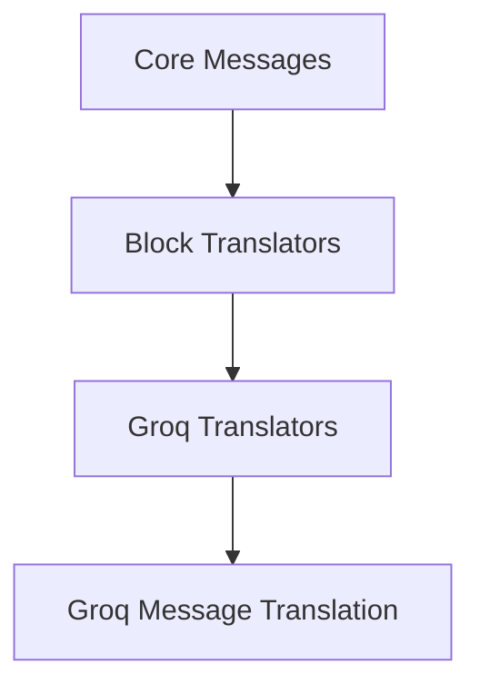

# Groq Message Translation Module

## Introduction

The `groq_message_translation` module is a specialized component within the `langchain_core` library, specifically designed to handle the translation of Groq-specific message structures into a standardized format. This module is crucial for ensuring interoperability and consistent message processing across various language models and internal `langchain_core` components. It abstracts away the nuances of Groq's message representation, providing a unified interface for content handling.

## Architecture Overview

This module is nested within the `block_translators` sub-module, under the `groq_translators` section, signifying its role as a dedicated translator for Groq messages. It directly utilizes Groq-specific message types (`AIMessage`, `AIMessageChunk`) and converts them into generic `ContentBlock` types, which are foundational for `langchain_core`'s internal message representation. This architectural placement ensures that Groq message translation is handled efficiently and specifically, without affecting other message translation mechanisms.

<!-- DIAGRAM_JSON
{
    "direction": "TD",
    "nodes": [
        {"id": "core_messages", "label": "Core Messages", "type": "module", "link": "core_messages.md"},
        {"id": "block_translators", "label": "Block Translators", "type": "module", "link": "block_translators.md"},
        {"id": "groq_translators", "label": "Groq Translators", "type": "module", "link": "groq_translators.md"},
        {"id": "groq_message_translation", "label": "Groq Message Translation", "type": "module"}
    ],
    "edges": [
        {"source": "core_messages", "target": "block_translators"},
        {"source": "block_translators", "target": "groq_translators"},
        {"source": "groq_translators", "target": "groq_message_translation"}
    ],
    "groups": []
}
-->

## Core Functionality

The `groq_message_translation` module provides the essential functions for converting Groq-specific AI message formats into a standardized list of content blocks. This standardization is critical for subsequent processing and consistent handling within `langchain_core`.

### `translate_content`

Translates a complete `AIMessage` object from Groq into a list of standard `ContentBlock` objects. This function is used when a full AI message has been received and needs to be parsed into a format usable by other `langchain_core` components.

**Component ID:** `libs.core.langchain_core.messages.block_translators.groq.translate_content`

### `translate_content_chunk`

Translates an `AIMessageChunk` object from Groq into a list of standard `ContentBlock` objects. This function is particularly useful for streaming scenarios where message content is received in chunks, allowing for incremental processing and real-time updates.

**Component ID:** `libs.core.langchain_core.messages.block_translators.groq.translate_content_chunk`
