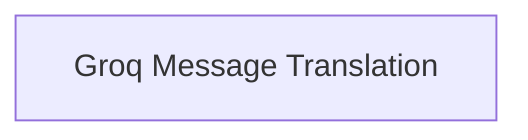

# Groq Translators Module

The `groq_translators` module is responsible for translating AI messages and message chunks from the Groq platform into a standardized format used throughout the system. This ensures compatibility and consistent processing of content originating from Groq.

## Architecture

The `groq_translators` module consists of a single sub-module focused on handling the translation logic.

<!-- DIAGRAM_JSON
{
    "direction": "TD",
    "nodes": [
        {"id": "groq_message_translation", "label": "Groq Message Translation", "type": "module", "link": "groq_message_translation.md"}
    ],
    "edges": [],
    "groups": []
}
-->

## Sub-modules

### [Groq Message Translation](groq_message_translation.md)
This sub-module contains the core logic for translating Groq-specific AI messages (`AIMessage`) and message chunks (`AIMessageChunk`) into the system's standard content block format. It ensures that content from Groq can be seamlessly integrated and processed by other parts of the application.