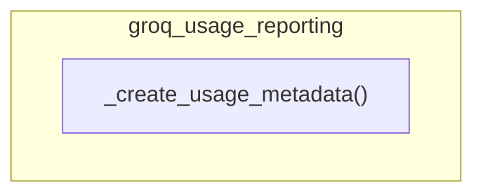

# groq_usage_reporting
This module provides utilities for reporting Groq API usage, specifically converting raw token usage data into a standardized `UsageMetadata` format. It supports various Groq API response structures for accurate token accounting.

<!-- DIAGRAM_JSON
{
  "nodes": [
    {
      "id": "module:groq_usage_reporting",
      "label": "groq_usage_reporting",
      "type": "module"
    },
    {
      "id": "function:_create_usage_metadata",
      "label": "_create_usage_metadata",
      "type": "function"
    }
  ],
  "edges": [],
  "groups": [
    {
      "id": "module:groq_usage_reporting",
      "label": "groq_usage_reporting",
      "nodes": [
        "function:_create_usage_metadata"
      ]
    }
  ]
}
-->
