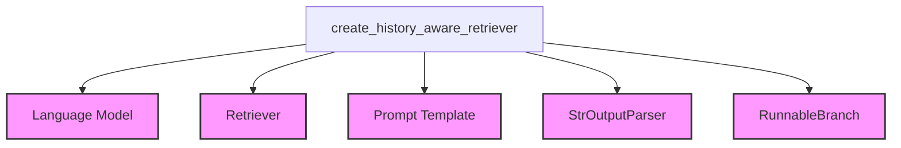

# history_aware_retrievers Module Documentation

## Introduction

The `history_aware_retrievers` module provides a crucial component for building conversational AI applications: a retriever chain that can intelligently incorporate chat history to generate more relevant search queries. This module facilitates dynamic document retrieval by rephrasing user input based on the ongoing conversation, ensuring that the context of previous interactions is maintained.

## Core Functionality

The primary function of this module is `create_history_aware_retriever`. This function constructs a runnable chain that takes user input and, optionally, conversation history to produce a refined search query. This query is then passed to an underlying retriever to fetch relevant documents.

### `create_history_aware_retriever`

```python
def create_history_aware_retriever(
    llm: LanguageModelLike,
    retriever: RetrieverLike,
    prompt: BasePromptTemplate,
) -> RetrieverOutputLike:
    # ... (code details in component section)
```

This function performs the following steps:
1.  **Conditional Logic**: It checks if `chat_history` is present in the input.
2.  **Direct Retrieval (No History)**: If no `chat_history` is provided, the `input` is directly passed to the `retriever`.
3.  **History-Aware Rephrasing**: If `chat_history` exists, the `prompt` and `llm` are used to generate a new, rephrased search query based on both the current `input` and the `chat_history`. This rephrased query is then sent to the `retriever`.
4.  **Output**: Returns an LCEL `Runnable` that can be invoked with `input` and `chat_history` (if applicable) to retrieve documents.

## Architecture and Component Relationships

The `history_aware_retrievers` module's core `create_history_aware_retriever` function orchestrates interactions between a language model (LLM), a retriever, and a prompt template, often utilizing components from the `core_runnables` and `core_output_parsers` modules for constructing the conditional logic and processing LLM output.

<!-- DIAGRAM_JSON
{
    "direction": "TD",
    "nodes": [
        {"id": "create_history_aware_retriever", "label": "create_history_aware_retriever", "type": "component", "link": null},
        {"id": "language_model", "label": "Language Model", "type": "external", "link": "core_language_models.md"},
        {"id": "retriever_module", "label": "Retriever", "type": "external", "link": "core_retrievers.md"},
        {"id": "prompt_module", "label": "Prompt Template", "type": "external", "link": "core_prompts.md"},
        {"id": "output_parser_module", "label": "StrOutputParser", "type": "external", "link": "core_output_parsers.md"},
        {"id": "runnables_module", "label": "RunnableBranch", "type": "external", "link": "core_runnables.md"}
    ],
    "edges": [
        {"source": "create_history_aware_retriever", "target": "language_model"},
        {"source": "create_history_aware_retriever", "target": "retriever_module"},
        {"source": "create_history_aware_retriever", "target": "prompt_module"},
        {"source": "create_history_aware_retriever", "target": "output_parser_module"},
        {"source": "create_history_aware_retriever", "target": "runnables_module"}
    ],
    "groups": []
}
-->


## How the Module Fits into the Overall System

The `history_aware_retrievers` module is a part of the `classic_chains_conversational` package, signifying its role in enabling advanced conversational capabilities within the LangChain framework. It acts as an intermediary layer between user input (and conversation history) and a document retriever, enhancing the relevance of retrieved information in dialogue-based applications. This module is essential for building robust chatbots and question-answering systems that can maintain context over multiple turns of conversation, leading to a more natural and intelligent user experience. It leverages core LangChain components like language models, prompts, and runnables to achieve its functionality.
