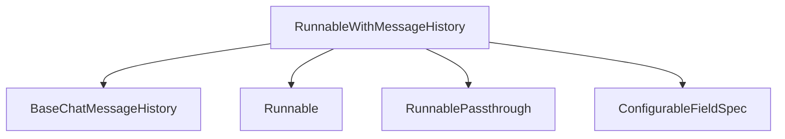

# `history_runnables` Module Documentation

## Introduction

The `history_runnables` module provides the `RunnableWithMessageHistory` component, a crucial building block for creating conversational AI applications. This runnable wraps another `Runnable` and automatically manages chat message history, allowing for stateful interactions within a stateless `Runnable` framework.

## Purpose and Core Functionality

The primary purpose of `RunnableWithMessageHistory` is to simplify the integration of conversational history into any `Runnable`. It handles the complexities of reading existing chat messages, incorporating new user inputs, and persisting the conversation's output back into a message history store.

Key functionalities include:

*   **History Management**: Automatically loads and appends messages to a `BaseChatMessageHistory` instance.
*   **Flexible Input/Output Handling**: Adapts to various input and output formats of the wrapped `Runnable`, whether it expects a list of messages, a string, or a dictionary with specific message keys.
*   **Configurable History Retrieval**: Supports custom configuration for retrieving chat history instances, allowing for complex session management (e.g., based on `user_id` and `conversation_id`).
*   **Asynchronous Support**: Provides asynchronous methods for history interaction, ensuring compatibility with async `Runnable` operations.

## Architecture and Component Relationships

`RunnableWithMessageHistory` acts as a wrapper around a core `Runnable`, enhancing it with chat history capabilities. It leverages external components for managing the actual message storage and for constructing its internal processing flow.

<!-- DIAGRAM_JSON
{
    "direction": "TD",
    "nodes": [
        {"id": "runnable_with_message_history", "label": "RunnableWithMessageHistory", "type": "component", "link": null},
        {"id": "base_chat_message_history", "label": "BaseChatMessageHistory", "type": "external", "link": "core_chat_history.md"},
        {"id": "runnable", "label": "Runnable", "type": "external", "link": "base_runnables.md"},
        {"id": "runnable_passthrough", "label": "RunnablePassthrough", "type": "external", "link": "passthrough_runnables.md"},
        {"id": "configurable_field_spec", "label": "ConfigurableFieldSpec", "type": "external", "link": "base_runnables.md"}
    ],
    "edges": [
        {"source": "runnable_with_message_history", "target": "base_chat_message_history"},
        {"source": "runnable_with_message_history", "target": "runnable"},
        {"source": "runnable_with_message_history", "target": "runnable_passthrough"},
        {"source": "runnable_with_message_history", "target": "configurable_field_spec"}
    ],
    "groups": []
}
-->

### Component Relationships:

*   **`RunnableWithMessageHistory`**: The central component of this module. It orchestrates the flow of messages to and from the wrapped `Runnable` and the chat history store.
*   **`BaseChatMessageHistory`**: An abstract base class (defined in the [`core_chat_history`](core_chat_history.md) module) that defines the interface for chat message storage and retrieval. `RunnableWithMessageHistory` relies on concrete implementations of this class to store and retrieve conversational history.
*   **`Runnable`**: The generic interface for all runnables in LangChain (defined in the [`base_runnables`](base_runnables.md) module). `RunnableWithMessageHistory` wraps any compatible `Runnable` to imbue it with history-aware capabilities.
*   **`RunnablePassthrough`**: A utility `Runnable` (from the [`passthrough_runnables`](passthrough_runnables.md) module) used internally by `RunnableWithMessageHistory` to pass inputs directly or assign new values without modifying the original input structure. It's used for injecting history into the input dictionary.
*   **`ConfigurableFieldSpec`**: (from the [`base_runnables`](base_runnables.md) module) Used to define the configurable parameters for the `get_session_history` factory function, allowing for flexible specification of how chat history sessions are identified and retrieved.

## How the Module Fits into the Overall System

The `history_runnables` module, specifically `RunnableWithMessageHistory`, is an integral part of the `core_runnables` system. It provides a standardized and flexible way to add conversational memory to any `Runnable`, making it easier to build intelligent agents and chatbots that can maintain context across multiple turns.

By abstracting the complexities of history management, it promotes modularity and reusability within the LangChain ecosystem. Developers can focus on the core logic of their `Runnable` components, knowing that conversational history will be handled seamlessly by `RunnableWithMessageHistory`.