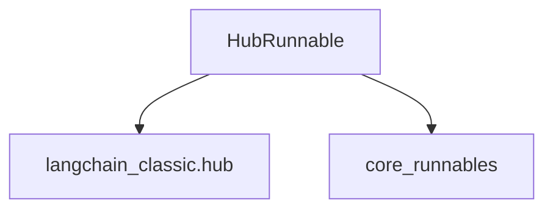

# hub_integration Module Documentation

## Introduction

The `hub_integration` module facilitates the integration of LangChain runnables with the LangChain Hub. Its primary function is to enable developers to pull and utilize runnables that are hosted on the LangChain Hub directly within their applications, leveraging a standardized approach for remote runnable management.

## Module Overview

The core component of this module is the `HubRunnable` class, which acts as a proxy for runnables stored in the LangChain Hub. When initialized, `HubRunnable` fetches the specified runnable from the Hub, allowing it to be used as any other local runnable. This abstraction simplifies the process of incorporating community-contributed or centrally managed runnables into LangChain applications.

### Core Components

#### `HubRunnable`

*   **Purpose**: Represents a runnable that is fetched from the LangChain Hub. It extends `RunnableBindingBase` to provide a seamless integration with the LangChain runnable interface.
*   **Initialization**: 
    *   `owner_repo_commit`: A crucial identifier for the runnable on the Hub, specified in the format `owner/prompt_name:commit_hash`, `owner/prompt_name`, or simply `prompt_name` for personal prompts.
    *   `api_url` (optional): The URL for the LangChain Hub API. Defaults to the hosted service or a localhost instance.
    *   `api_key` (optional): An API key for authenticating with the LangChain Hub.
*   **Functionality**: Upon instantiation, `HubRunnable` internally calls the `pull` function from the `langchain_classic.hub` module to retrieve the actual runnable. It then binds this pulled runnable, making it ready for execution.

## Architecture

The `hub_integration` module is a leaf module within the `classic_runnables` package. It depends on external components for its core functionality: `core_runnables` for its base class `RunnableBindingBase`, and `langchain_classic.hub` for the mechanism to retrieve runnables from the LangChain Hub.

<!-- DIAGRAM_JSON
{
    "direction": "TD",
    "nodes": [
        {"id": "hub_runnable", "label": "HubRunnable", "type": "component", "link": null},
        {"id": "langchain_classic_hub", "label": "langchain_classic.hub", "type": "external", "link": "langchain_classic_hub.md"},
        {"id": "core_runnables", "label": "core_runnables", "type": "external", "link": "core_runnables.md"}
    ],
    "edges": [
        {"source": "hub_runnable", "target": "langchain_classic_hub"},
        {"source": "hub_runnable", "target": "core_runnables"}
    ],
    "groups": []
}
-->

### Component Relationships

*   **`HubRunnable`** is the primary component within this module.
*   It **inherits** from `RunnableBindingBase`, which is part of the [core_runnables](core_runnables.md) module, establishing its identity as a runnable that can be bound to other runnables.
*   It **utilizes** the `pull` function from the `langchain_classic.hub` module to fetch runnable definitions from the LangChain Hub. For more details on the pulling mechanism, refer to the [langchain_classic_hub](langchain_classic_hub.md) documentation.

## Integration with Overall System

The `hub_integration` module is an integral part of the `classic_runnables` ecosystem, providing a bridge to the LangChain Hub. By encapsulating the logic for fetching and utilizing remote runnables, it promotes modularity and reusability across different LangChain applications. This module allows developers to easily extend their applications with shared or community-developed runnables without needing to manage their code directly. It adheres to the runnable interface defined in [core_runnables](core_runnables.md), ensuring compatibility with the broader LangChain framework.