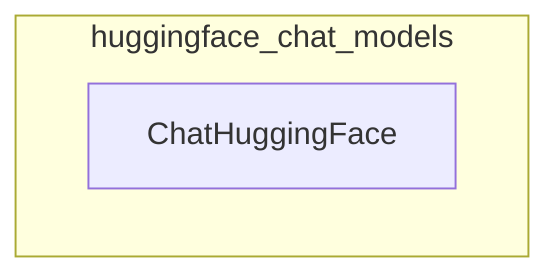

# huggingface_chat_models
This module provides the `ChatHuggingFace` class, enabling the use of various Hugging Face LLMs as LangChain ChatModels. It integrates with `HuggingFaceTextGenInference`, `HuggingFaceEndpoint`, `HuggingFaceHub`, and `HuggingFacePipeline`.

<!-- DIAGRAM_JSON
{
  "nodes": [
    {
      "id": "ChatHuggingFace",
      "label": "ChatHuggingFace",
      "metadata": {
        "type": "class"
      }
    }
  ],
  "edges": [],
  "groups": [
    {
      "id": "huggingface_chat_models",
      "label": "huggingface_chat_models",
      "nodes": [
        "ChatHuggingFace"
      ],
      "metadata": {
        "type": "module"
      }
    }
  ]
}
-->
