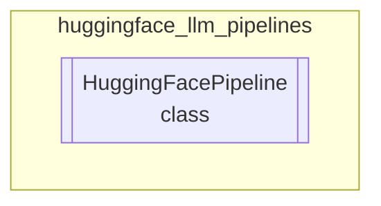

# huggingface_llm_pipelines
This module provides the `HuggingFacePipeline` class, a LangChain-compatible wrapper for Hugging Face models, enabling various NLP tasks like text generation and summarization through a unified interface.

<!-- DIAGRAM_JSON
{
  "nodes": [
    {
      "id": "HuggingFacePipeline",
      "label": "HuggingFacePipeline",
      "type": "class"
    }
  ],
  "edges": [],
  "groups": [
    {
      "id": "huggingface_llm_pipelines",
      "label": "huggingface_llm_pipelines",
      "type": "module",
      "contents": [
        "HuggingFacePipeline"
      ]
    }
  ]
}
-->
