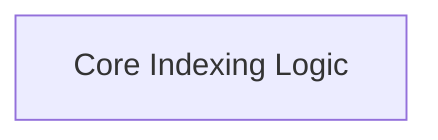

# Indexing API Module

The `indexing_api` module provides core functionalities for asynchronously indexing data into vector stores and managing document records. It offers robust tools for handling document updates, deletions, and deduplication, ensuring efficient and consistent data synchronization between source documents and the indexing system.

## Architecture Overview

The `indexing_api` module primarily consists of a core indexing logic sub-module that orchestrates the document processing, hashing, and interaction with record managers and vector stores. It focuses on providing a flexible and efficient mechanism for maintaining up-to-date document indices.

<!-- DIAGRAM_JSON
{
    "direction": "TD",
    "nodes": [
        {"id": "indexing_core", "label": "Core Indexing Logic", "type": "module", "link": "indexing_core.md"}
    ],
    "edges": [],
    "groups": []
}
-->

## Sub-modules

### [Core Indexing Logic](indexing_core.md)

This sub-module (`indexing_core`) encapsulates the primary asynchronous indexing function (`aindex`) and utility functions for hashing document content (`_hash_nested_dict`). It handles the complex logic of comparing documents, identifying changes, and coordinating updates with the record manager and the target vector store. It supports various cleanup strategies (incremental, full, scoped_full) to manage stale documents effectively.