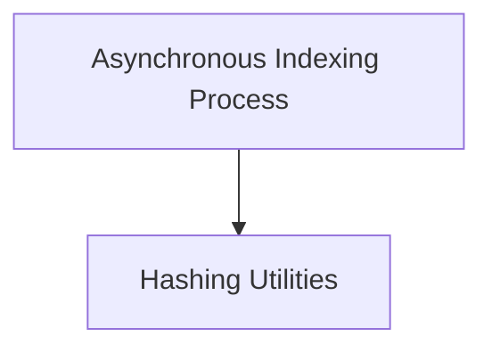

# Indexing Core Module

## Introduction
The `indexing_core` module provides the foundational components for efficiently managing and indexing documents within vector stores or document indexes. It includes asynchronous processing capabilities for data ingestion and utilities for content hashing to ensure data integrity and deduplication.

## Architecture Overview
The `indexing_core` module is structured to handle the end-to-end process of document indexing. It primarily consists of an asynchronous indexing process that orchestrates the flow of documents from a source to a vector store, and a set of hashing utilities used internally for generating unique identifiers for documents.

<!-- DIAGRAM_JSON
{
    "direction": "TD",
    "nodes": [
        {"id": "async_indexing_process", "label": "Asynchronous Indexing Process", "type": "module", "link": "async_indexing_process.md"},
        {"id": "hashing_utilities", "label": "Hashing Utilities", "type": "module", "link": "hashing_utilities.md"}
    ],
    "edges": [
        {"source": "async_indexing_process", "target": "hashing_utilities", "label": "uses"}
    ],
    "groups": []
}
-->

## Sub-modules:

*   **[Asynchronous Indexing Process](async_indexing_process.md)**
    This sub-module contains the core `aindex` function, responsible for asynchronously indexing documents. It manages document batches, deduplication, and various cleanup strategies (incremental, full, scoped_full) to maintain the integrity and consistency of the indexed data.

*   **[Hashing Utilities](hashing_utilities.md)**
    This sub-module provides essential utility functions, such as `_hash_nested_dict`, for generating consistent and unique hashes for document content and metadata. These hashes are crucial for tracking document versions and ensuring efficient deduplication during the indexing process.
