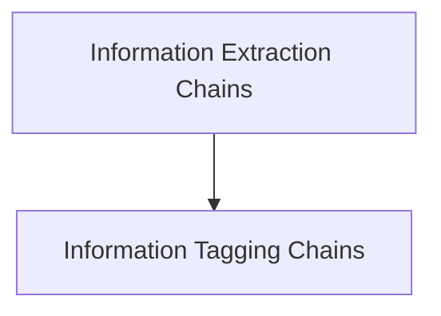

# Information Extraction Module

The `information_extraction` module provides functionalities for extracting and tagging structured information from unstructured text using OpenAI function-calling capabilities. It offers tools to create robust chains for both general information extraction and specific data tagging, leveraging either dictionary-based schemas or Pydantic models.

## Architecture Overview

The `information_extraction` module is composed of two main sub-modules: `extraction_chains` and `tagging_chains`. The `extraction_chains` handle the primary task of extracting structured data, while `tagging_chains` focus on categorizing or labeling text based on a defined schema. Both sub-modules utilize language models and prompt templates to achieve their goals.

<!-- DIAGRAM_JSON
{
    "direction": "TD",
    "nodes": [
        {"id": "extraction_chains", "label": "Information Extraction Chains", "type": "module", "link": "extraction_chains.md"},
        {"id": "tagging_chains", "label": "Information Tagging Chains", "type": "module", "link": "tagging_chains.md"}
    ],
    "edges": [
        {"source": "extraction_chains", "target": "tagging_chains"}
    ],
    "groups": []
}
-->

## Sub-modules

### [Extraction Chains](extraction_chains.md)
This sub-module focuses on creating chains specifically designed for extracting structured data from text. It supports both raw dictionary schemas and Pydantic models for defining the output structure.

### [Tagging Chains](tagging_chains.md)
This sub-module provides functions for creating chains that tag or categorize text based on a defined schema. It also supports both dictionary-based and Pydantic schemas. It is important to note that the functions in this sub-module are deprecated in favor of `with_structured_output` for modern usage.