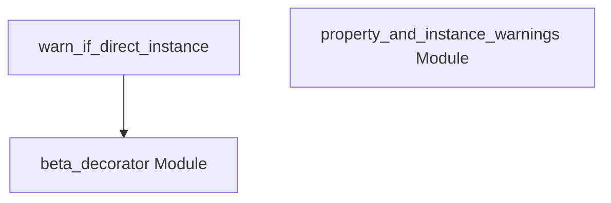

# instance_warnings Module Documentation

## Introduction

The `instance_warnings` module is responsible for emitting warnings when specific "beta" classes are directly instantiated. Its primary purpose is to inform developers about the provisional nature of certain components, guiding them towards more stable or recommended usage patterns. This module leverages a core utility function to ensure these warnings are displayed appropriately and only once per unique instance type.

## Core Functionality

The core of the `instance_warnings` module is encapsulated in the `warn_if_direct_instance` function. This function acts as a mechanism to detect and report direct instantiations of classes marked as "beta."

### `warn_if_direct_instance`

```python
def warn_if_direct_instance(
    self: Any, *args: Any, **kwargs: Any
) -> Any:
    """Warn that the class is in beta."""
    nonlocal warned
    if not warned and type(self) is obj and not is_caller_internal():
        warned = True
        emit_warning()
    return wrapped(self, *args, **kwargs)
```

**Purpose:**
This function serves as a wrapper or decorator that, when applied to a class, will issue a warning message if an instance of that class is directly created by user code (i.e., not by internal system calls).

**Key Logic:**
*   **`nonlocal warned`**: Manages a flag to ensure the warning is emitted only once for a given class type, preventing repetitive messages.
*   **`type(self) is obj`**: Checks if the `self` object is a direct instance of the target `obj` (the beta class), rather than a subclass. This ensures warnings are specific to direct usage.
*   **`not is_caller_internal()`**: Determines if the call originates from internal framework code or from external user code. Warnings are typically only emitted for external user calls.
*   **`emit_warning()`**: The actual function call that triggers the warning message to be displayed.
*   **`return wrapped(self, *args, **kwargs)`**: After the warning check, the original constructor or method (`wrapped`) is invoked to complete the instance creation or method execution.

## Architecture and Component Relationships

The `instance_warnings` module is a leaf module focused on a specific warning mechanism. It primarily utilizes the `warn_if_direct_instance` function, which is defined within the `beta_decorator` utility module.

<!-- DIAGRAM_JSON
{
    "direction": "TD",
    "nodes": [
        {"id": "warn_if_direct_instance_func", "label": "warn_if_direct_instance", "type": "component", "link": null},
        {"id": "beta_decorator_module", "label": "beta_decorator Module", "type": "external", "link": "beta_decorator.md"},
        {"id": "property_and_instance_warnings_module", "label": "property_and_instance_warnings Module", "type": "external", "link": "property_and_instance_warnings.md"}
    ],
    "edges": [
        {"source": "warn_if_direct_instance_func", "target": "beta_decorator_module"}
    ],
    "groups": []
}
-->



*   **`warn_if_direct_instance`**: This is the core component within the `instance_warnings` module, responsible for the warning logic.
*   **[beta_decorator Module](beta_decorator.md)**: This external utility module is where the `warn_if_direct_instance` function is physically defined, providing the underlying implementation for the warning mechanism.
*   **[property_and_instance_warnings Module](property_and_instance_warnings.md)**: This module is the direct parent of `instance_warnings` in the module hierarchy, indicating a logical grouping of instance-related and property-related warning functionalities.

## System Integration

The `instance_warnings` module is a specialized part of the broader `core_api.beta_warnings` system. It fits within the `property_and_instance_warnings` module, which in turn is a child of the `beta_warnings` module. This hierarchical placement suggests that `instance_warnings` contributes to a comprehensive warning system for beta features, specifically focusing on direct instance creation. Developers interacting with beta classes that employ this warning mechanism will receive clear notifications, helping them understand the evolving nature of the API. This ensures a smoother transition as features mature and best practices are established throughout the framework.
