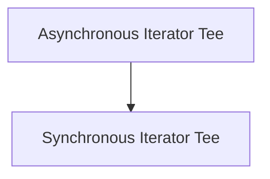

# Iterator Utilities Module

The `iterator_utilities` module provides essential tools for managing and manipulating iterators, both synchronous and asynchronous. Its primary function is to enable the creation of multiple independent iterators from a single source iterable, facilitating scenarios where the same data stream needs to be processed by different consumers concurrently or sequentially without re-fetching the source.

## Architecture

The module is composed of two core sub-modules, each providing a `Tee` class tailored for its specific iterator type: asynchronous and synchronous. These `Tee` implementations allow for efficient, lazy splitting of iterables, buffering items only as necessary to keep child iterators synchronized.

<!-- DIAGRAM_JSON
{
    "direction": "TD",
    "nodes": [
        {"id": "asynchronous_iterator_tee", "label": "Asynchronous Iterator Tee", "type": "module", "link": "asynchronous_iterator_tee.md"},
        {"id": "synchronous_iterator_tee", "label": "Synchronous Iterator Tee", "type": "module", "link": "synchronous_iterator_tee.md"}
    ],
    "edges": [
        {"source": "asynchronous_iterator_tee", "target": "synchronous_iterator_tee"}
    ],
    "groups": []
}
-->

## Sub-modules

### [Asynchronous Iterator Tee](asynchronous_iterator_tee.md)
This sub-module focuses on utilities for asynchronous iterators. It contains the `Tee` class, designed to create multiple independent asynchronous iterators from a single asynchronous iterable. This is particularly useful in concurrent programming environments where multiple tasks need to consume the same stream of asynchronous data.

### [Synchronous Iterator Tee](synchronous_iterator_tee.md)
This sub-module provides utilities for synchronous iterators. Similar to its asynchronous counterpart, it offers a `Tee` class that allows for splitting a single synchronous iterable into several independent synchronous iterators. This is valuable for scenarios where synchronous data streams need to be processed by multiple consumers without re-reading the source.
