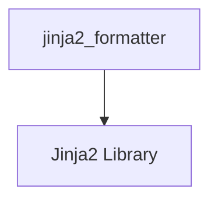

# Jinja2 Formatting Module

The `jinja2_formatting` module provides a secure utility for rendering Jinja2 templates within the LangChain framework. It is a critical component for dynamically generating prompt strings using the Jinja2 templating language.

## Module Purpose and Core Functionality

This module's primary purpose is to safely format string templates using Jinja2, allowing for flexible and dynamic prompt construction. It integrates the robust templating capabilities of Jinja2 while emphasizing security considerations.

### Core Component: `jinja2_formatter`

The `jinja2_formatter` function is the main entry point for using Jinja2 templates. It takes a template string and a dictionary of variables, rendering the template into a final string. The function is designed with security in mind, utilizing Jinja2's `SandboxedEnvironment` to mitigate risks associated with untrusted templates. However, it explicitly warns users about the inherent dangers of executing Jinja2 templates from unverified sources, as they can still lead to arbitrary Python code execution.

#### Key Features:
-   **Template Rendering:** Renders Jinja2 template strings with provided variables.
-   **Dependency Check:** Verifies the installation of the `jinja2` library and provides an informative error message if it's missing.
-   **Sandboxed Environment:** Employs Jinja2's `SandboxedEnvironment` to restrict access to potentially dangerous attributes (`__class__`, `__globals__`), offering a layer of protection against sandbox escapes. **(Note: This is a best-effort security measure; untrusted templates should still be avoided.)**

## Architecture and Component Relationships

The `jinja2_formatting` module is a leaf module within the prompt formatting hierarchy. It directly utilizes the `jinja2` library for its core functionality.

<!-- DIAGRAM_JSON
{
    "direction": "TD",
    "nodes": [
        {"id": "jinja2_formatter", "label": "jinja2_formatter", "type": "component", "link": null},
        {"id": "jinja2_lib", "label": "Jinja2 Library", "type": "external", "link": null}
    ],
    "edges": [
        {"source": "jinja2_formatter", "target": "jinja2_lib"}
    ],
    "groups": []
}
-->

## How the Module Fits into the Overall System

The `jinja2_formatting` module is situated within the [string_formatters](string_formatters.md) module, which is part of the larger [core_prompts](core_prompts.md) system. It provides a specific mechanism for formatting prompt templates, alongside other formatting options like [mustache_formatting](mustache_formatting.md).

Its role is to enable developers to define dynamic prompts using Jinja2 syntax, allowing for complex logic, conditionals, and loops within prompt construction. This flexibility is crucial for building intelligent agents and applications that require adaptable and context-aware interactions.

By offering a dedicated and security-conscious Jinja2 formatter, this module ensures that prompt engineering in LangChain is both powerful and as safe as possible when dealing with template-based inputs.