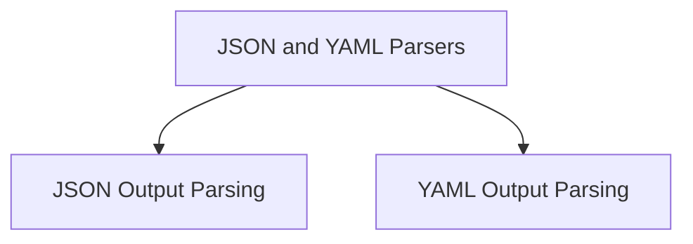

# `json_and_yaml_parsers` Module Documentation

## Introduction

The `json_and_yaml_parsers` module provides robust output parsers for converting Language Model (LLM) generated text into structured JSON and YAML formats. This module is essential for applications that require LLM outputs to adhere to specific data schemas, enabling seamless integration with other system components that expect structured data.

## Architecture Overview

The `json_and_yaml_parsers` module is composed of two primary sub-modules:

*   **`json_parser`**: Focuses on parsing LLM outputs into JSON objects based on predefined `ResponseSchema` definitions.
*   **`yaml_parser`**: Handles the parsing of LLM outputs into YAML objects, leveraging Pydantic models for strict schema validation.

These sub-modules work independently but serve the common goal of providing reliable structured output parsing capabilities within the system.

<!-- DIAGRAM_JSON
{
    "direction": "TD",
    "nodes": [
        {"id": "json_parser", "label": "JSON Output Parsing", "type": "module", "link": "json_parser.md"},
        {"id": "yaml_parser", "label": "YAML Output Parsing", "type": "module", "link": "yaml_parser.md"}
    ],
    "edges": [
        {"source": "json_and_yaml_parsers", "target": "json_parser"},
        {"source": "json_and_yaml_parsers", "target": "yaml_parser"}
    ],
    "groups": []
}
-->

## High-Level Functionality

### [JSON Output Parsing (`json_parser.md`)](json_parser.md)

This sub-module provides functionality to parse LLM outputs into structured JSON. It utilizes `ResponseSchema` definitions to guide the parsing process, ensuring that the output conforms to the expected JSON structure. This is particularly useful for applications requiring precise data extraction from free-form text generated by LLMs.

### [YAML Output Parsing (`yaml_parser.md`)](yaml_parser.md)

The `yaml_parser` sub-module is designed for parsing LLM outputs into YAML format. It leverages Pydantic models to define the expected YAML schema, offering robust validation and type checking for the parsed output. This ensures data integrity and consistency when working with YAML-formatted LLM responses.
