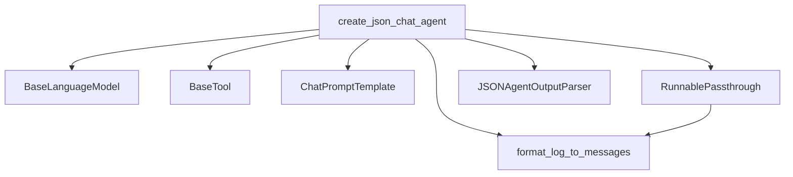

# json_chat_agents

The `json_chat_agents` module provides a factory function for creating conversational agents that communicate and act using a structured JSON format. These agents are specifically designed to work with chat models, enabling them to interpret and generate JSON-formatted responses for tool usage and final answers.

## Purpose and Core Functionality

The primary purpose of this module is to simplify the creation of agents that leverage large language models (LLMs) to interact with a set of tools by parsing and generating JSON. This allows for a robust and explicit communication protocol between the LLM and the system, making agent actions clear and predictable.

### `create_json_chat_agent`

The `create_json_chat_agent` function is the core component of this module. It constructs a `Runnable` sequence that defines the agent's behavior.

-   **Inputs**:
    -   `llm`: A language model (e.g., a chat model) that will drive the agent's reasoning.
    -   `tools`: A list of `BaseTool` instances that the agent can use to perform actions.
    -   `prompt`: A `ChatPromptTemplate` that guides the LLM on how to interact, including instructions for using tools and formatting output as JSON.
    -   `stop_sequence`: Optional. Defines sequences that, when generated by the LLM, should stop its generation, typically used to prevent hallucination of "Observation:" text.
    -   `tools_renderer`: A function to convert the `tools` into a string description suitable for inclusion in the prompt.
    -   `template_tool_response`: A string template used to format the output of tool executions (observations) before feeding them back to the LLM.

-   **Output**: A `Runnable` object that takes an input dictionary (containing user input, chat history, etc.) and returns either an `AgentAction` (indicating a tool to be used) or an `AgentFinish` (the final response).

The agent's interaction loop involves:
1.  Receiving input.
2.  Formatting intermediate steps (previous actions and observations) into an `agent_scratchpad`.
3.  Sending the formatted prompt (including tools description, tool names, chat history, and scratchpad) to the `llm`.
4.  Parsing the LLM's JSON output to determine the next action (either calling a tool or providing a final answer).

## Architecture and Component Relationships

The `json_chat_agents` module, through its `create_json_chat_agent` function, orchestrates several components to form a functional agent.

<!-- DIAGRAM_JSON
{
    "direction": "TD",
    "nodes": [
        {"id": "create_json_chat_agent", "label": "create_json_chat_agent", "type": "component", "link": null},
        {"id": "llm", "label": "BaseLanguageModel", "type": "external", "link": "core_language_models.md"},
        {"id": "base_tool", "label": "BaseTool", "type": "external", "link": "core_tools.md"},
        {"id": "chat_prompt_template", "label": "ChatPromptTemplate", "type": "external", "link": "core_prompts.md"},
        {"id": "runnable_passthrough", "label": "RunnablePassthrough", "type": "external", "link": "core_runnables.md"},
        {"id": "json_agent_output_parser", "label": "JSONAgentOutputParser", "type": "component", "link": null},
        {"id": "format_log_to_messages", "label": "format_log_to_messages", "type": "component", "link": null}
    ],
    "edges": [
        {"source": "create_json_chat_agent", "target": "llm"},
        {"source": "create_json_chat_agent", "target": "base_tool"},
        {"source": "create_json_chat_agent", "target": "chat_prompt_template"},
        {"source": "create_json_chat_agent", "target": "runnable_passthrough"},
        {"source": "create_json_chat_agent", "target": "json_agent_output_parser"},
        {"source": "create_json_chat_agent", "target": "format_log_to_messages"},
        {"source": "runnable_passthrough", "target": "format_log_to_messages"}
    ],
    "groups": []
}
-->

**Internal Components:**

-   **`create_json_chat_agent`**: The main function responsible for configuring and assembling the agent's runnable sequence.
-   **`JSONAgentOutputParser`**: An internal parser component used to interpret the JSON output generated by the LLM, transforming it into structured `AgentAction` or `AgentFinish` objects.
-   **`format_log_to_messages`**: A utility function that converts the agent's intermediate steps (a log of previous actions and observations) into a list of messages, which are then added to the `agent_scratchpad` for the LLM to consider in its next turn.

**External Dependencies:**

-   **`BaseLanguageModel`** ([core_language_models.md](core_language_models.md)): The underlying LLM or chat model used by the agent for reasoning and generating responses.
-   **`BaseTool`** ([core_tools.md](core_tools.md)): Represents the callable tools that the agent can execute.
-   **`ChatPromptTemplate`** ([core_prompts.md](core_prompts.md)): Defines the structure and content of the prompts sent to the LLM, including instructions for JSON output.
-   **`RunnablePassthrough`** ([core_runnables.md](core_runnables.md)): A component from the `core_runnables` module used here to inject the `agent_scratchpad` into the input before passing it to the prompt.

## How it Fits into the Overall System

The `json_chat_agents` module is a specialized component within the broader `classic_agents.structured_agents` category. It provides a concrete implementation for building agents that rely on a JSON-based interaction format, making it particularly suitable for scenarios where structured and machine-readable agent outputs are desired.

It sits atop several core LangChain components:
-   It utilizes language models defined in `core_language_models` as its reasoning engine.
-   It interacts with tools managed by the `core_tools` module, allowing agents to perform external actions.
-   It relies heavily on prompt engineering facilitated by `core_prompts` to guide the LLM's behavior and output format.
-   The entire agent's execution flow is constructed using the flexible `Runnable` interface from `core_runnables`, enabling seamless integration into larger LangChain expression language (LCEL) chains.