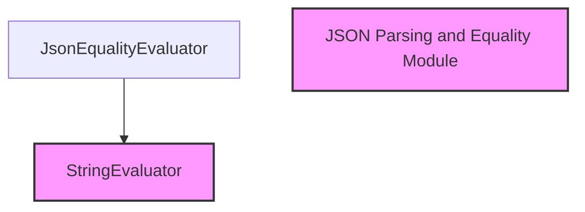

# json_equality_evaluation

The `json_equality_evaluation` module provides functionality for evaluating the equality of strings after parsing them as JSON objects. This module is a specialized part of the overall evaluation framework, focusing on robust JSON comparison, including handling of lists and custom comparison logic.

## Core Functionality

The primary component of this module is the `JsonEqualityEvaluator` class.

### JsonEqualityEvaluator

The `JsonEqualityEvaluator` is a `StringEvaluator` that determines if a prediction string is equivalent to a reference string when both are treated as JSON. This evaluation is flexible, allowing for custom comparison operators.

**Key Features:**
*   **JSON Parsing**: Both the prediction and reference strings are parsed into JSON objects (dictionaries, lists, primitives). The `_parse_json` internal method handles this, utilizing a `parse_json_markdown` utility for robust parsing.
*   **Custom Operator Support**: Developers can provide a custom `operator` function to define how the parsed prediction and reference JSON objects should be compared. If no custom operator is provided, a standard equality check (`eq`) is used.
*   **List Handling**: When comparing JSON arrays (lists), the evaluator sorts both the parsed prediction and reference lists before comparison. This ensures that the order of elements in a list does not affect the equality check, making the comparison robust to permutations.
*   **Evaluation Name**: The evaluation metric is consistently named "json_equality".
*   **Input Requirements**: This evaluator does not require an input string (`requires_input` is `False`) but strictly requires a reference string (`requires_reference` is `True`).

**Examples:**

```python
from operator import eq
from typing import Any, Callable, cast
from langchain_core.utils.json import parse_json_markdown
from langchain_classic.evaluation.parsing.base import StringEvaluator, JsonEqualityEvaluator # Assuming StringEvaluator is imported or defined here for context

# Basic equality check
evaluator = JsonEqualityEvaluator()
print(evaluator.evaluate_strings('{"a": 1}', reference='{"a": 1}'))
# Expected output: {'score': True}
print(evaluator.evaluate_strings('{"a": 1}', reference='{"a": 2}'))
# Expected output: {'score': False}

# Custom operator to compare only a specific key
def custom_operator(x: Any, y: Any) -> bool:
    return x.get("a") == y.get("a")

evaluator_custom = JsonEqualityEvaluator(operator=custom_operator)
print(evaluator_custom.evaluate_strings('{"a": 1, "b": 10}', reference='{"a": 1, "c": 20}'))
# Expected output: {'score': True} (because 'a' is equal)
print(evaluator_custom.evaluate_strings('{"a": 1}', reference='{"a": 2}'))
# Expected output: {'score': False}
```

## Architecture and Relationships

The `json_equality_evaluation` module is part of the `classic_evaluation_parsing` package, specifically residing under `json_parsing_and_equality`. It builds upon the `StringEvaluator` interface, inheriting its foundational methods for string evaluation.

<!-- DIAGRAM_JSON
{
    "direction": "TD",
    "nodes": [
        {"id": "json_equality_evaluator", "label": "JsonEqualityEvaluator", "type": "component", "link": null},
        {"id": "string_evaluator", "label": "StringEvaluator", "type": "external", "link": "classic_evaluation_parsing.md"},
        {"id": "json_parsing_and_equality_module", "label": "JSON Parsing and Equality Module", "type": "external", "link": "json_parsing_and_equality.md"}
    ],
    "edges": [
        {"source": "json_equality_evaluator", "target": "string_evaluator"}
    ],
    "groups": []
}
-->

