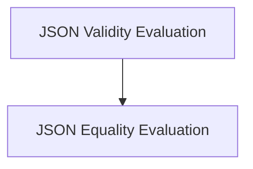

# JSON Parsing and Equality Module

This module provides functionalities for evaluating JSON strings, specifically focusing on validating if a string is a well-formed JSON and comparing two JSON strings for equality.

## Architecture

The `json_parsing_and_equality` module is composed of two main sub-modules:

*   **[JSON Validity Evaluation](json_validity_evaluation.md)**: Handles the validation of JSON string format.
*   **[JSON Equality Evaluation](json_equality_evaluation.md)**: Compares two JSON strings for structural and value equality.

<!-- DIAGRAM_JSON
{
    "direction": "TD",
    "nodes": [
        {"id": "json_validity_evaluation", "label": "JSON Validity Evaluation", "type": "module", "link": "json_validity_evaluation.md"},
        {"id": "json_equality_evaluation", "label": "JSON Equality Evaluation", "type": "module", "link": "json_equality_evaluation.md"}
    ],
    "edges": [
        {"source": "json_validity_evaluation", "target": "json_equality_evaluation"}
    ],
    "groups": []
}
-->

## Sub-modules

This section outlines the primary sub-modules within `json_parsing_and_equality` and their respective functionalities.

### [JSON Validity Evaluation](json_validity_evaluation.md)

This sub-module contains the `JsonValidityEvaluator` component, which is responsible for checking if a given string constitutes valid JSON. It is used to ensure that JSON inputs adhere to the correct syntax and structure.

### [JSON Equality Evaluation](json_equality_evaluation.md)

The `json_equality_evaluation` sub-module includes the `JsonEqualityEvaluator` component. This component allows for the comparison of two JSON strings, verifying if they are equivalent after being parsed into Python objects. This is crucial for validation and testing scenarios where the exact content of JSON outputs needs to be confirmed.