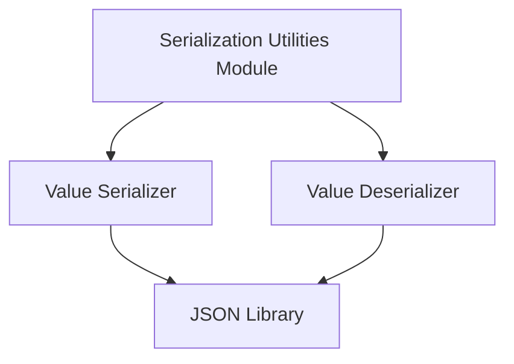

# `json_serialization_utilities` Module Documentation

## Introduction

The `json_serialization_utilities` module provides essential functions for serializing and deserializing lists of floating-point numbers to and from JSON format. This module is a core part of the `classic_embeddings` caching mechanism, specifically within the `cache_backed_embeddings` module, enabling efficient storage and retrieval of embedding vectors.

## Architecture and Component Relationships

This module contains two primary utility functions responsible for the serialization and deserialization processes. These functions directly interact with Python's built-in `json` library to perform their operations. They are integral to the caching layer in `classic_embeddings`, ensuring that embedding values can be correctly stored and retrieved from a cache.

<!-- DIAGRAM_JSON
{
    "direction": "TD",
    "nodes": [
        {"id": "_value_serializer", "label": "Value Serializer", "type": "component", "link": null},
        {"id": "_value_deserializer", "label": "Value Deserializer", "type": "component", "link": null},
        {"id": "json_lib", "label": "JSON Library", "type": "external", "link": null},
        {"id": "serialization_utilities", "label": "Serialization Utilities Module", "type": "external", "link": "serialization_utilities.md"}
    ],
    "edges": [
        {"source": "_value_serializer", "target": "json_lib"},
        {"source": "_value_deserializer", "target": "json_lib"},
        {"source": "serialization_utilities", "target": "_value_serializer"},
        {"source": "serialization_utilities", "target": "_value_deserializer"}
    ],
    "groups": []
}
-->



## Core Functionality

This module exposes the following key functions:

### `_value_serializer`

```python
def _value_serializer(value: Sequence[float]) -> bytes:
    """Serialize a value."""
    return json.dumps(value).encode()
```

This function takes a sequence of floating-point numbers (`Sequence[float]`) and serializes it into a JSON string, which is then encoded into `bytes`. This byte representation is suitable for storage in a cache.

### `_value_deserializer`

```python
def _value_deserializer(serialized_value: bytes) -> list[float]:
    """Deserialize a value."""
    return cast("list[float]", json.loads(serialized_value.decode()))
```

This function performs the reverse operation of `_value_serializer`. It accepts a `bytes` object (representing a JSON-encoded list of floats), decodes it into a string, and then deserializes the JSON string back into a `list[float]`.

## How the Module Fits into the Overall System

The `json_serialization_utilities` module is a low-level utility within the `classic_embeddings` component. Its primary role is to provide the serialization and deserialization logic required by the [serialization_utilities](serialization_utilities.md) module, which in turn supports the caching mechanisms for embeddings. By handling the conversion between Python objects (lists of floats) and byte-encoded JSON, it ensures that embedding vectors can be persistently stored and efficiently retrieved from various caching backends without loss of data integrity. This directly contributes to the performance and resource optimization of applications utilizing cached embeddings.
