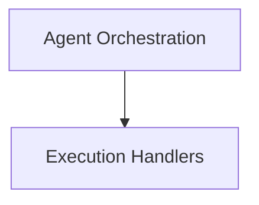

# `langchain_v1_agents_factory` Module Documentation

## Introduction

The `langchain_v1_agents_factory` module is responsible for the creation and configuration of LangChain agents. It provides the core `create_agent` function, which orchestrates the setup of an agent's execution graph, integrating language models, tools, middleware, and state management to define how an agent interacts with its environment and processes information.

## Architecture Overview

The `langchain_v1_agents_factory` module establishes a robust architecture for agent construction and runtime execution. It primarily comprises components for orchestrating the agent's initial setup and managing its subsequent operational flow, including model interactions and tool usage.

<!-- DIAGRAM_JSON
{
    "direction": "TD",
    "nodes": [
        {"id": "agent_orchestration", "label": "Agent Orchestration", "type": "module", "link": "agent_orchestration.md"},
        {"id": "execution_handlers", "label": "Execution Handlers", "type": "module", "link": "execution_handlers.md"}
    ],
    "edges": [
        {"source": "agent_orchestration", "target": "execution_handlers"}
    ],
    "groups": []
}
-->

## Sub-modules

### [Agent Orchestration](agent_orchestration.md)
This sub-module focuses on the foundational aspects of agent creation. It contains the primary `create_agent` function, which is responsible for assembling the various components—such as language models, tools, and middleware—into a cohesive and executable agent graph. This module ensures that the agent is correctly configured and ready to operate.

### [Execution Handlers](execution_handlers.md)
This sub-module manages the runtime behavior and decision-making within the agent's operational loop. It includes components like `model_node` and `amodel_node` for handling synchronous and asynchronous model requests, along with utilities for processing middleware and directing the agent's flow based on model outputs and tool interactions. This ensures dynamic and responsive agent execution.
