The `langchain_v1_agents_middleware` module provides a comprehensive set of middleware components designed to intercept, modify, and enhance the behavior of LangChain V1 agents. These middlewares offer crucial functionalities such as enforcing execution policies, managing sensitive information (PII), dynamically adjusting context, handling file system interactions, implementing human-in-the-loop interventions, controlling model and tool call limits, enabling model fallbacks and retries, facilitating tool emulation and selection, and managing agent-specific tasks like todo lists and summarization. This modular approach allows for flexible and robust agent customization and control.

### Architecture Overview

The `langchain_v1_agents_middleware` module acts as a central hub for various specialized middleware components. Each sub-module addresses a specific cross-cutting concern or enhancement for agent operations.

```mermaid
graph TD
    A[langchain_v1_agents_middleware]
    B[Execution Policies]
    C[Redaction]
    D[Context Editing]
    E[File Search]
    F[Human-in-the-Loop]
    G[Model Call Limit]
    H[Model Fallback]
    I[Model Retry]
    J[PII Handling]
    K[Shell Tool]
    L[Summarization]
    M[Todo List Middleware]
    N[Tool Call Limit]
    O[Tool Emulation]
    P[Tool Retry]
    Q[Tool Selection]
    R[Middleware Types]

    A --> B
    A --> C
    A --> D
    A --> E
    A --> F
    A --> G
    A --> H
    A --> I
    A --> J
    A --> K
    A --> L
    A --> M
    A --> N
    A --> O
    A --> P
    A --> Q
    A --> R

    click B "execution_policies.md" "View Execution Policies Documentation"
    click C "redaction.md" "View Redaction Documentation"
    click D "context_editing.md" "View Context Editing Documentation"
    click E "file_search.md" "View File Search Documentation"
    click F "human_in_the_loop.md" "View Human-in-the-Loop Documentation"
    click G "model_call_limit.md" "View Model Call Limit Documentation"
    click H "model_fallback.md" "View Model Fallback Documentation"
    click I "model_retry.md" "View Model Retry Documentation"
    click J "pii_handling.md" "View PII Handling Documentation"
    click K "shell_tool.md" "View Shell Tool Documentation"
    click L "summarization.md" "View Summarization Documentation"
    click M "todo_list.md" "View Todo List Middleware Documentation"
    click N "tool_call_limit.md" "View Tool Call Limit Documentation"
    click O "tool_emulation.md" "View Tool Emulation Documentation"
    click P "tool_retry.md" "View Tool Retry Documentation"
    click Q "tool_selection.md" "View Tool Selection Documentation"
    click R "middleware_types.md" "View Middleware Types Documentation"
```

### References to Core Components Documentation

The `langchain_v1_agents_middleware` module is composed of several sub-modules, each providing specific functionalities:

*   **[Execution Policies](execution_policies.md)**: Defines and implements various strategies for executing commands, primarily within a sandbox or isolated environment, crucial for enhancing security.
*   **[Redaction](redaction.md)**: Dedicated to identifying and redacting sensitive information from text content, enhancing security and privacy.
*   **[Context Editing](context_editing.md)**: Provides middleware for automatically managing the context size of agent interactions by pruning tool results when token counts exceed thresholds.
*   **[File Search](file_search.md)**: Enables agents to perform efficient file system operations within a defined root path, including glob and grep search capabilities.
*   **[Human-in-the-Loop](human_in_the_loop.md)**: (Purpose: Enables human intervention and oversight in agent decision-making and execution flows.)
*   **[Model Call Limit](model_call_limit.md)**: Provides a crucial middleware component for managing and enforcing limits on model calls within an agent's execution.
*   **[Model Fallback](model_fallback.md)**: Enables automatic fallback to alternative models when a primary model call fails, enhancing the robustness of agent operations.
*   **[Model Retry](model_retry.md)**: (Purpose: Provides mechanisms for automatically retrying failed model calls to improve agent resilience against transient errors.)
*   **[PII Handling](pii_handling.md)**: Provides a robust middleware for detecting and managing Personally Identifiable Information (PII) within conversational agents.
*   **[Shell Tool](shell_tool.md)**: Integrates a persistent shell execution tool into Langchain agents, enabling command execution with security policies.
*   **[Summarization](summarization.md)**: Intelligently manages conversation history within agent-based systems by automatically summarizing older messages to prevent context window overflow.
*   **[Todo List Middleware](todo_list.md)**: Provides a robust middleware solution for agents to manage structured task lists (todos), enabling them to break down complex problems.
*   **[Tool Call Limit](tool_call_limit.md)**: Manages and enforces limits on the number of tool calls made during the execution of an agent, crucial for controlling resource usage.
*   **[Tool Emulation](tool_emulation.md)**: Allows developers to simulate tool executions using a Language Model (LLM) instead of performing actual tool calls, useful for testing and prototyping.
*   **[Tool Retry](tool_retry.md)**: Provides a robust middleware for automatically retrying failed tool calls within an agent's execution flow, enhancing resilience.
*   **[Tool Selection](tool_selection.md)**: Intelligently filters the available tools for an agent by leveraging a separate LLM to select only the most relevant tools for a given user query.
*   **[Middleware Types](middleware_types.md)**: Defines the fundamental types and wrapper functions used within the agent middleware system, providing core structures for handling tool call requests.