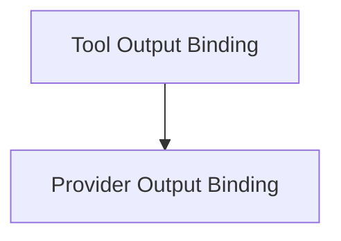

# Langchain V1 Agents Structured Output Module

This module is responsible for managing structured output within the Langchain V1 agents framework. It provides mechanisms for handling responses generated either through explicit tool calls or native provider outputs, ensuring that these responses conform to predefined schemas.

## Architecture Overview

The `langchain_v1_agents_structured_output` module is composed of two primary sub-modules, each addressing a specific method of structured output handling:

<!-- DIAGRAM_JSON
{
    "direction": "TD",
    "nodes": [
        {"id": "tool_output_binding", "label": "Tool Output Binding", "type": "module", "link": "tool_output_binding.md"},
        {"id": "provider_output_binding", "label": "Provider Output Binding", "type": "module", "link": "provider_output_binding.md"}
    ],
    "edges": [
        {"source": "tool_output_binding", "target": "provider_output_binding"}
    ],
    "groups": []
}
-->

## Sub-modules

### [Tool Output Binding](tool_output_binding.md)

This sub-module, represented by the `OutputToolBinding` component, focuses on managing structured output that results from explicit tool calls. It binds a given schema (Pydantic model, dataclass, TypedDict, or JSON schema dict) to a `StructuredTool` instance, allowing for the parsing of tool arguments according to the defined schema.

### [Provider Output Binding](provider_output_binding.md)

The `ProviderStrategyBinding` component in this sub-module handles structured output generated natively by the underlying language model provider. It extracts text content from `AIMessage` responses and parses it as JSON, validating and converting it into the specified schema type. This ensures proper interpretation of provider-enforced structured outputs.