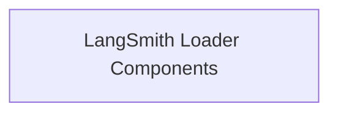

# LangSmith Integration Module

## Introduction
The `langsmith_integration` module provides functionality for loading data from LangSmith datasets into `Document` objects. This module is essential for integrating LangSmith examples into applications, enabling use cases like few-shot example retrieval and dataset-driven model evaluation.

## Architecture Overview
The `langsmith_integration` module consists of core components for interacting with the LangSmith API and formatting the retrieved data. The main component is the `LangSmithLoader`, which utilizes a helper function `_stringify` for content processing.

<!-- DIAGRAM_JSON
{
    "direction": "TD",
    "nodes": [
        {"id": "langsmith_loader_components", "label": "LangSmith Loader Components", "type": "module", "link": "langsmith_loader_components.md"}
    ],
    "edges": [],
    "groups": []
}
-->

## Sub-modules

### [LangSmith Loader Components](langsmith_loader_components.md)
This sub-module contains the primary logic for loading examples from LangSmith datasets and preparing their content for use as `Document` objects. It includes the `LangSmithLoader` class and the `_stringify` utility function.