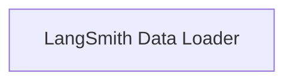

# LangSmith Loader Components

The `langsmith_loader_components` module provides functionality for loading examples from LangSmith datasets and converting them into `Document` objects. This is particularly useful for creating few-shot example retrievers.

## Architecture Overview

The module is composed of a single core component that manages the connection to the LangSmith API and handles the extraction and formatting of data into `Document` objects.

<!-- DIAGRAM_JSON
{
    "direction": "TD",
    "nodes": [
        {"id": "langsmith_data_loader", "label": "LangSmith Data Loader", "type": "module", "link": "langsmith_data_loader.md"}
    ],
    "edges": [],
    "groups": []
}
-->

## Sub-modules

### [LangSmith Data Loader](langsmith_data_loader.md)

This sub-module encapsulates the logic for interacting with the LangSmith API to retrieve dataset examples and transforming them into `Document` objects. It includes utilities for stringifying content and the main loader class.
