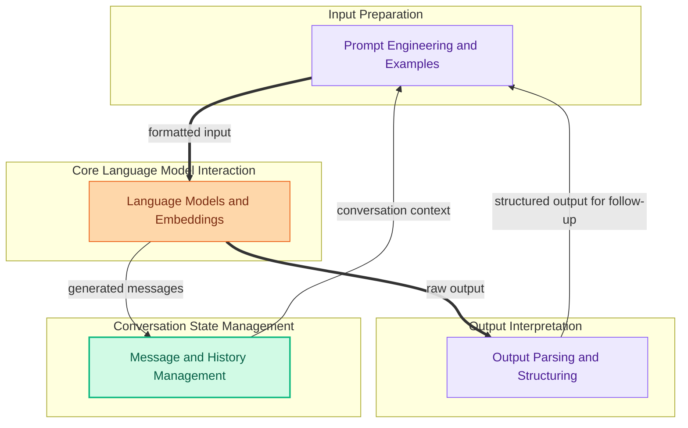

The `language_model_interface` module provides the foundational components for interacting with language models, managing conversational context, structuring prompts, and parsing model outputs. It serves as the central hub for defining how AI models receive input, generate responses, and how those responses are interpreted and stored.

### Module Architecture

### Core Components

*   **[Models and Embeddings](models_and_embeddings.md)**: Defines the abstract interfaces for language models (`BaseLanguageModel`, `LLM`, `SimpleChatModel`) and embedding models, along with concrete implementations and utilities for initialization and caching. This is where the actual AI generation capabilities are exposed.
*   **[Prompts and Examples](prompts_and_examples.md)**: Provides tools for constructing and managing prompts, including various template types (`BasePromptTemplate`, `StringPromptTemplate`, `ChatMessagePromptTemplate`) and mechanisms for few-shot example selection (`SemanticSimilarityExampleSelector`). It ensures that language models receive well-structured and contextually rich input.
*   **[Message and History Management](messages_and_history.md)**: Handles the representation and storage of chat messages and conversation history (`InMemoryChatMessageHistory`). It includes utilities for translating content blocks from different AI providers and processing messages (e.g., token counting, filtering).
*   **[Output Parsing](output_parsing.md)**: Offers a suite of parsers (`BaseOutputParser`, `XMLOutputParser`, `CommaSeparatedListOutputParser`, `StructuredOutputParser`) to transform raw language model outputs into structured, usable formats. This component is crucial for extracting specific data or commands from free-form text generated by models.