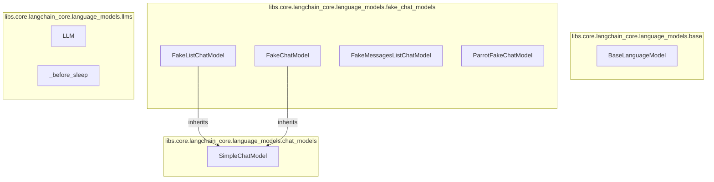

# language_model_interfaces
This module defines core interfaces for interacting with language models, including abstract base classes for general language models and chat models, along with several fake implementations for testing.

<!-- DIAGRAM_JSON
{
  "nodes": [
    {"id": "BLM", "label": "BaseLanguageModel", "type": "class"},
    {"id": "SCM", "label": "SimpleChatModel", "type": "class"},
    {"id": "FLCM", "label": "FakeListChatModel", "type": "class"},
    {"id": "FCM", "label": "FakeChatModel", "type": "class"},
    {"id": "FMCM", "label": "FakeMessagesListChatModel", "type": "class"},
    {"id": "PFCM", "label": "ParrotFakeChatModel", "type": "class"},
    {"id": "LLM_CLASS", "label": "LLM", "type": "class"},
    {"id": "BFS", "label": "_before_sleep", "type": "function"}
  ],
  "edges": [
    {"source": "FLCM", "target": "SCM", "type": "inheritance"},
    {"source": "FCM", "target": "SCM", "type": "inheritance"}
  ],
  "groups": [
    {"id": "base", "label": "libs.core.langchain_core.language_models.base", "nodes": ["BLM"]},
    {"id": "chat_models", "label": "libs.core.langchain_core.language_models.chat_models", "nodes": ["SCM"]},
    {"id": "fake_chat_models", "label": "libs.core.langchain_core.language_models.fake_chat_models", "nodes": ["FLCM", "FCM", "FMCM", "PFCM"]},
    {"id": "llms", "label": "libs.core.langchain_core.language_models.llms", "nodes": ["LLM_CLASS", "BFS"]}
  ]
}
-->
